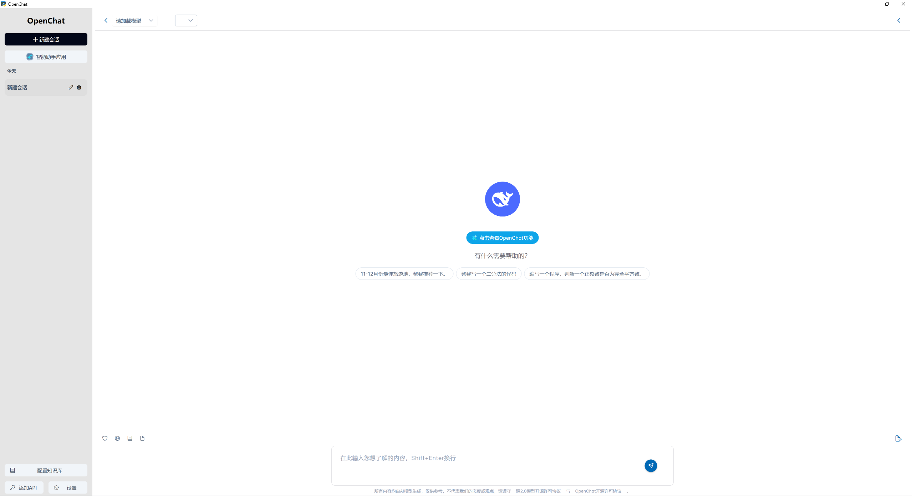

<p align="right">
  <a href="./README.md">中文</a> | English

Here is the client installation package officially released by OpenChat. It is open source based on the MIT protocol and supports fast installation and use on multiple platforms. For most users, it is recommended to directly use the official version provided by us. The installation is simple and convenient, and it ensures that you can experience the latest and most complete functions. You can select the installation package suitable for your device in the link below to download:

### Download for Desktop
<table style="width: 100%">
  <tr>
    <td width="25%" align="center">
      <b>Windows</b>
    </td>
    <td width="25%" align="center">
      <b>MacOS</b>
    </td>
    
  </tr>
  <tr style="text-align: center">
    <td align="center" valign="middle">
      <a href='https://metabrain.oss-cn-beijing.aliyuncs.com/openchat/OpenChatSetup.exe'>
        
        <br />
        <b>Setup.exe</b>
      </a>
    </td>
    <td align="center" valign="middle">
      <a href='https://metabrain.oss-cn-beijing.aliyuncs.com/openchat/OpenChat.dmg'>
        
        <br />
        <b>Intel</b>
      </a>
    </td>
    
    
  </tr>
</table>

---


# OpenChat - Your All-in-One AI Platform


OpenChat is a client application that provides a conversational AI experience powered by large models. It allows users to easily interact with multiple AI models for knowledge-based Q&A, web information retrieval, knowledge management, and document-based conversations.



---

## Key Features

### 🚀 **Intelligent AI Assistant Platform**

- 🌐 **Compatible with Leading Cloud-based AI Models**: Supports OpenAI, Deepseek, Silicon Flow, etc.
- 🔗 **Integrated with Popular AI Platforms**: Tencent Cloud, Baidu Qianfan Cloud, Kimi AI, Chatglm, etc.
- 🖥 **Supports Local Model Deployment**: Compatible with Ollama, on-premise server deployment, and other offline solutions.

### 🧠 **Versatile AI Assistant**
- 🤖 **AI Assistant Applications**: Integrates Kimi, Meta AI Search, Wenxin Yiyan, Doubao, and more for seamless access to multiple AI platforms.
- 🔍 **Sensitive Content Detection**: Accurately identifies sensitive content to ensure compliance.
- 📚 **Knowledge-based Q&A**: Intelligently processes various inquiries and provides reliable answers.

### 🌍 **Powerful Information Retrieval & Knowledge Management**
- 🔗 **Web Information Retrieval**: Real-time search for the latest data to aid decision-making.
- 📖 **Intelligent Knowledge Base**: Personalized knowledge storage for easy management and access.
- 📝 **Document-based Conversations**: Supports interactive Q&A for text, PDF, and Office documents, enhancing reading efficiency.

### 🧩 **Practical Tools & Extended Features**
- 🔎 **Smart Search**: Quickly locate information and improve efficiency.
- 🌐 **Multi-modal Support**: Handles text, images, and various document formats.
- 📤 **Content Management & Sharing**: Easily organize and share knowledge.

### ✨ **Exceptional User Experience**
- 🖥 **Cross-platform Compatibility**: Supports Windows and macOS.
- ⚡ **Plug and Play**: No complex configuration required; ready to use out of the box.
- 📑 **Markdown Rendering**: Clear and structured document presentation.
- 🚀 **High Performance & Stability**: Ensures a smooth and efficient experience.
- 💡 **Multi-model Interaction**: Gain insights from different perspectives.

<br>

---

### 📃 Upcoming Features

- [x] Multi-model result comparison for diverse perspectives
- [x] AI Assistant applications
- [x] Personalized data backup
- [x] Updated sensitive content detection
- [x] Full model internet access support
- [x] Enhanced web search features
- [x] Knowledge base and document conversation updates
- [x] First official release
- [x] Continuous improvements and performance optimizations
- [ ] Custom prompt creation
- [ ] Immersive translation
- [ ] AI coding assistant
- [ ] Personalized AI agents

More features coming soon...

---

## 💻 Configuration & Usage

### 1. System Requirements
Memory: 8GB or more
Operating System: Windows 10/11 (64-bit) & macOS (Intel chip)

### 2. Installation
#### Step 1: Download OpenChat Installer
- OpenChat User Guide (this document) provides download, installation, and usage instructions.
- OpenChat Installer (Windows): `OpenChatSetup.exe`
- OpenChat Installer (macOS): `OpenChat.dmg`

#### Step 2: Install OpenChat Client
After downloading `OpenChatSetup.exe`, double-click the file, accept the user agreement, select the installation path (e.g., `X:\...\OpenChat`), and wait for the automatic installation to complete.

For macOS, open `OpenChat.dmg`, then drag `OpenChat.app` to the Applications folder. Due to the security protection mechanism of the MacOS system, if a risk warning appears when it is opened, choose to trust the program. If the program cannot be opened because the developer cannot be verified, you can double-click it again to open it or click Open Still under the Security tab in System & Preferences.

### 3. Usage
For detailed explanations of features and instructions on how to use the program, please refer to <a href="./doc/intro/userguide.md">OpenChat User Guide</a>.

<br>

---

## 📦 Packaging & Deployment

OpenChat supports packaging and distribution on **macOS** and **Windows**. Below are the basic packaging steps.

### 🍎 macOS Packaging Guide

1. **Environment Preparation**: Ensure Python 3.10 and necessary dependencies are installed.
2. **Code Adjustments**: Modify paths, permissions, and other settings for macOS compatibility.
3. **Use PyInstaller for Packaging**:
   ```sh
   pyinstaller --clean --onedir --windowed --name "OpenChat" \
     --add-data "pkg:pkg" \
     --add-data "assets:assets" \
     --osx-bundle-identifier com.example.openchat \
     --hidden-import=imghdr \
     yuanchat.py
   ```
4. **Manually Add Missing Dependencies**: Copy missing `site-packages` dependencies to the `Frameworks` directory.
5. **Create a DMG Package** (Optional):
   ```sh
   hdiutil create -volname "OpenChat" -srcfolder "dist/OpenChat.app" -ov -format UDBZ "OpenChat.dmg"
   ```

📄 **Detailed macOS Packaging Guide** 👉 [Mac Packaging Guide](doc/packaging/mac_packaging.md)

---

### 💻 Windows Packaging Guide

1. **Install Python and Dependencies** (Recommended: 3.10.11/3.10.12 versions).
2. **Create Virtual Environment and Install Dependencies**:
   ```sh
   pip install virtualenv
   virtualenv venv --python=python3.10.11
   pip install -r requirements.txt
   ```
3. **Adjust Python Dependencies**:
   - Modify `pypandoc` and `pytesseract` related code.
   - Place `nltk_data` into the `venv/Lib` directory.
4. **Use PyInstaller to Generate Executable File**:
   ```sh
   pyinstaller -D openchat.py
   pyinstaller openchat.spec
   ```
5. **Run `openchat.exe` and Test Dependencies**: Manually add missing dependencies to the `_internal` directory.
6. **Use Inno Setup to Create an Installation Package** (Requires [Inno Setup Compiler](https://jrsoftware.org/isdl.php)).
7. **Execute `openchatsetup.iss` to Build the Final Installation Package**.

📄 **Detailed Windows Packaging Guide** 👉 [Windows Packaging Guide](doc/packaging/windows_packaging.md)

<br>

### 📌 Notes
- **It is recommended to use Python 3.10 and a virtual environment (venv) for isolation on all platforms**.
- **If dependencies are missing after packaging, check `site-packages` and manually add them**.
- **For Windows, Inno Setup is recommended for installation package creation**.
- **For both macOS and Windows, code signing is recommended to enhance security**.
