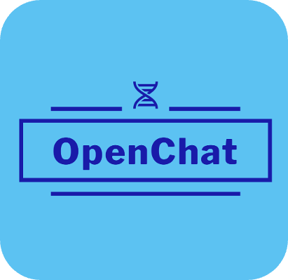
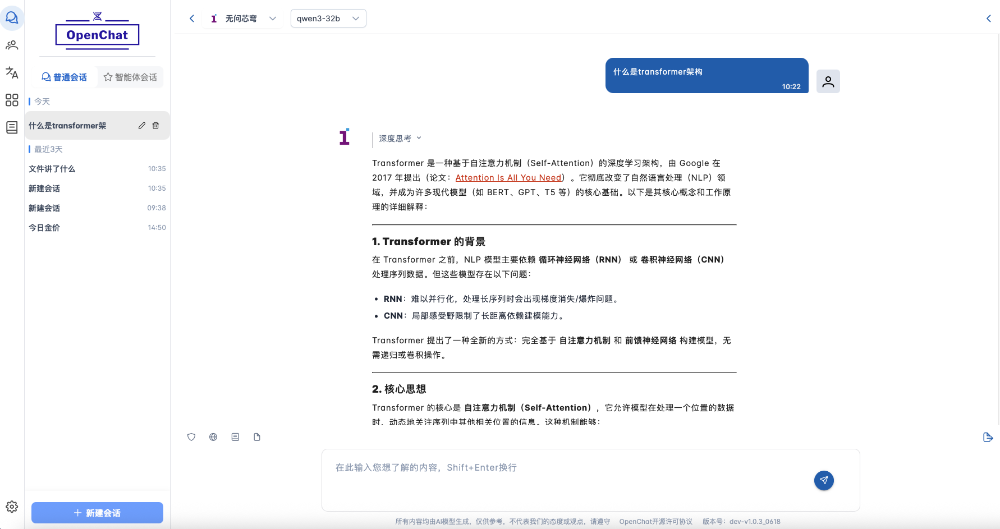

<br />
<div align="center">
  <a>
    
  </a>

  <p align="center">
    Open Source LLMs Chat Application

  </p>

  中文 | <a href="./README.en.md">English</a> 

</div>


## 🎉 最近更新

---


-  **[📅 OpenChat v1.0.2 更新日志（2025-05-15）👉](#-更新日志)**


<br>

# OpenChat - 你的一站式AI平台

---

OpenChat为客户端应用，提供一种基于大模型对话式交互模式，可以让用户很轻松的使用多种 AI 大模型，进行知识问答、网络信息检索、知识库以及文档对话等功能。

这里是 OpenChat 官方发布的客户端安装包，支持多平台快速安装使用。对于大多数用户而言，推荐直接使用我们提供的官方版本，安装简单方便，并确保能够体验最新最全的功能。你可以在下方链接中选择适合你设备的安装包进行下载：

OpenChat 声明不会收录您的任何个人信息，源码基于MIT协议开源，您所有的聊天记录和文件皆存在本地，如果您在Mac系统环境下首次打开 OpenChat 应用时遇到类似：**“无法打开，因为它来自身份不明的开发者”** 或 **“文件已损坏，您应该将其移到废纸篓”** 的问题，这是因为 macOS 的安全机制阻止了 App 运行。请点击 《[MacOS拦截修复指南](doc/intro/MAC运行.md)》，只需按照步骤设置一次，即可正常运行 OpenChat 应用。


###  Download Windows Installer 

- [OpenChat_apple.dmg](https://fastaistack.oss-cn-beijing.aliyuncs.com/openchat/OpenChatSetup_v1.0.2_win.exe) (Installer)


###  Download MacOS Installer

- [OpenChat_apple.dmg](https://fastaistack.oss-cn-beijing.aliyuncs.com/openchat/OpenChatSetup_v1.0.2_apple.dmg) (Apple Silicon)
- [OpenChat_intel.dmg](https://fastaistack.oss-cn-beijing.aliyuncs.com/openchat/OpenChatSetup_v1.0.2_intel.dmg) (Intel chips)


<br>
<br>




---

## 功能亮点

### 🚀 **智能 AI 助手平台**  

- 🌐 **兼容主流云端大模型**：如 OpenAI、Deepseek、硅基流动等  
- 🔗 **集成热门 AI 平台**：腾讯云、百度千帆云、Kimi Ai、智谱清言等  
- 🖥 **支持本地化模型部署**：适配 Ollama，服务器部署等本地运行方案  

### 🧠 **多功能智能助手**  
- 🤖 **智能助手应用**：集成Kimi，秘塔AI搜索，文心一言，豆包等应用，让你一站式访问国内多个大模型平台
- 🔍 **敏感词检测**：精准识别敏感内容，确保文本合规  
- 📚 **知识问答**：智能解析各类文件，快速提供可靠解答  

### 🌍 **强大信息检索与知识管理**  
- 🔗 **网络信息检索**：实时查找最新数据，助力决策分析  
- 📖 **智能知识库**：个性化知识存储，便捷管理、随时调用  
- 📝 **文档对话**：支持文本、PDF、word、ppt交互式问答，高效阅读  

###  🧩 **实用工具与扩展功能**  
- 🔎 **智能搜索**：快速定位信息，提高工作效率  
- 🌐 **多模态支持**：文本、图片、文档等多类型输入处理  
- 📤 **内容管理与分享**：便捷整理，轻松共享知识  

### ✨ **卓越体验，畅快使用**  
- 🖥 **跨平台支持**：适配 Windows、Mac  
- ⚡ **即装即用**：无需复杂配置，开箱即用  
- 📑 **Markdown 解析**: 文档呈现更清晰  
- 🚀 **高效稳定**：强大性能保障流畅体验
- 💡 **多模型协同交互**: 不同视角助力深入分析  

<br>


### 📃 即将实现的功能

- [x] 多模型结果对比
- [x] 添加智能助手应用
- [x] 对话数据备份
- [x] 敏感词检测功能更新
- [x] 网络检索功能更新
- [x] 知识库与文档对话功能更新
- [x] 首个正式版本发布
- [x] 持续改进与性能优化
- [ ] 自定义提示词
- [ ] 沉浸式翻译
- [ ] AI代码辅助
- [ ] 个性化智能体


更多功能敬请期待........

---

### 📝 更新日志

#### OpenChat v1.0.2

> 发布日期：2025年5月8日  
> 版本代号：v1.0.2

这是一次重要更新，新增三大核心功能：**智能体系统**、**沉浸式翻译模块** 和 **自动更新支持**，并加入了最新发布的 “Qwen3” 模型支持，显著提升了 OpenChat 的个性化能力、多语言处理能力以及整体使用体验。

---

### ✨ 新功能亮点

####  🌌 模型支持更新

新增支持最新发布的 **Qwen3** 推理语言大模型：
  - ☁️ 可通过以下平台在线体验：
    -  **硅基流动**
    -  **阿里云百炼**
    -  **无问芯穹**
  - 🖥️ 本地部署支持：
    - 使用 **Ollama** 快速运行 Qwen3 模型
    - 详见：**设置 → Ollama选项** 页面查看部署说明

#### 🤖 智能体系统（Agent System）

用户现在可以自主创建和管理个性化的智能体，赋予其独特的行为逻辑：

- **自定义智能体**：填写名称、分类、行为描述和系统提示词，快速创建属于你的专属智能体。

- **预制智能体助手**：无需配置，点击即可启用如编程助手、学习助手、产品经理等专业智能体，提升效率。

- **智能体会话窗口**：每个智能体拥有独立对话空间，支持模型切换、上下文记忆和提示推荐。


#### 🌐 AI沉浸式翻译模块（Immersive Translation）

一体化文档翻译与文本翻译体验，支持中/英/日/韩/法五种语言互译：

- **支持多种文件格式**：可上传 PDF、DOCX、TXT 文件，自动识别并翻译其内容。

- **沉浸式界面布局**：
  - **左侧**：文件翻译历史与状态管理
  - **右侧**：文本翻译、术语表配置与历史记录集成

- **灵活视图模式**：
  - 原文与译文并列展示
  - 仅显示译文内容
  - 可选开启同步滚动功能，提升阅读体验


#### 🔄 自动更新功能

OpenChat 现已支持自动更新，无需手动下载新版本：

- **启动时自动检测更新**：每次打开客户端时会后台检查是否有新版。
- **弹窗提示**：如有更新，将弹出对话框，展示版本号、更新时间与更新内容。
- **一键更新流程**：
  1. 自动下载新版本
  2. 自动替换旧应用
  3. 自动重新打开 OpenChat

⚠️ 在 macOS 系统下，更新过程中会弹出权限请求提示，需用户授权确认安装。

---

### 🛠 其他优化项

- 智能体与翻译模块现已支持状态记忆
- 修复了多平台下模型切换异常问题
- 提升了多语言界面提示与组件适配稳定性

---

### 📌 如何查看更新日志

- 查看完整版本内容与操作指南 👉 [查看更新日志](./doc/intro/v1.0.2.md)

---


## 💻  配置与使用

### 1. 配置要求
内存：8GB以上
系统：Windows10/11 64位 & MacOS系统 12.5以上（Intel芯片）
### 2. 安装
#### 步骤1：下载OpenChat安装包
* OpenChat使用指南（本文档），提供下载、安装、操作指南；
* OpenChat安装包（Windows），OpenChatSetup.exe，客户端软件；
* OpenChat安装包（Apple_Intel芯片），OpenChat.dmg，客户端软件 ；

#### 步骤2：OpenChat客户端安装
完成应用程序（OpenChatSetup.exe）下载后，双击文件并同意用户使用协议，选择安装路径（自定义安装路径X:\\...\OpenChat），等待OpenChat自动安装程序完成。

Mac版OpenChat.dmg打开后将看到OpenChat.app，将其拖动到应用文件夹下即可使用。由于MacOS系统的安全防护机制打开时如出现风险提示，选择信任该程序，如出现因为无法验证开发者无法打开的问题，可重新双击打开或者在系统与偏好中安全性选项卡下点仍要打开。

### 3. 使用

关于客户端配置流程，程序具体功能的讲解和使用说明，请参照 <a href="./doc/intro/使用指南.md">OpenChat使用指南</a> 。

<br>

---

## 📦 打包与部署

本项目支持 **macOS** 和 **Windows** 的打包与分发，以下是基本的打包步骤。

### 🍎 macOS 打包指南

1. **环境准备**：确保 Python 3.10 及必要依赖已安装。
2. **代码调整**：适配 macOS 系统，修改路径、权限等。
3. **使用 PyInstaller 进行打包**：
   ```sh
   pyinstaller --clean --onedir --windowed --name "OpenChat" \
     --add-data "pkg:pkg" \
     --add-data "assets:assets" \
     --osx-bundle-identifier com.example.openchat \
     --hidden-import=imghdr \
     openchat.py
   ```
4. **手动补充依赖**：将缺失的 `site-packages` 依赖复制到 `Frameworks` 目录。
5. **创建 DMG 安装包**（可选）：
   ```sh
   hdiutil create -volname "OpenChat" -srcfolder "dist/OpenChat.app" -ov -format UDBZ "OpenChat.dmg"
   ```

📄 **详细 macOS 版本适配和打包指南** 👉 [Mac 版打包指南](doc/packaging/mac适配打包指南.md)


### 💻 Windows 打包指南

1. **安装 Python 及依赖环境**（推荐 3.10.11/3.10.12 版本）。
2. **创建虚拟环境并安装依赖**：
   ```sh
   pip install virtualenv
   virtualenv venv --python=python3.10.11
   pip install -r requirements.txt
   ```
3. **调整 Python 依赖**：
   - 修改 `pypandoc` 和 `pytesseract` 相关代码。
   - 将 `nltk_data` 放入 `venv/Lib` 目录。
4. **使用 PyInstaller 生成可执行文件**：
   ```sh
   pyinstaller -D openchat.py
   pyinstaller openchat.spec
   ```
5. **运行 `openchat.exe` 测试依赖**，手动补充 `_internal` 目录中的缺失依赖。
6. **使用 Inno Setup 生成安装包**（需安装 [Inno Setup Compiler](https://jrsoftware.org/isdl.php)）。
7. **执行 `openchatsetup.iss` 构建最终安装包**。

📄 **详细 Windows 打包指南** 👉 [Windows 版打包指南](doc/packaging/windows打包指南.md)


<br>

### 📌 说明
- **建议所有平台使用 Python 3.10 并通过 venv 进行隔离**。
- **如果打包后缺少依赖，请检查 `site-packages` 并手动补充**。
- **Windows 版本建议使用 Inno Setup 进行安装包封装**。
- **对于 Mac 和 Windows，可使用代码签名提升安全性**。


