<p align="left">
  <a href="../../README.en.md">Back</a>

# OpenChat User Guide

---

### Step 1: Configuring the OpenChat Client
Before using OpenChat's conversational AI features, you need to apply for an API and download the models.

#### API Application

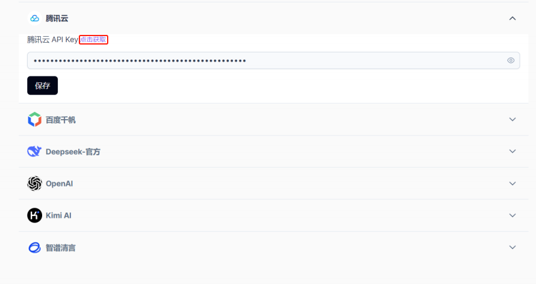

Click the `Settings` icon in the lower left corner to enter the `Model Management` interface.

YuanChat now supports multiple cloud-based large models. Before using the services of different AI providers, you need to configure API access. Click `Get API` to visit the providers' official websites and follow the steps to apply for an API key.

### ☁️ Currently Supported Cloud-based AI Services
OpenChat supports multiple **cloud-based AI models** that can be quickly integrated via API:

| Platform | API Application Link |
|----------|--------------------------------|
| **DeepSeek** | [Apply for API](https://platform.deepseek.com/api_keys) |
| **Tencent Cloud** | [Apply for API](https://console.cloud.tencent.com/lkeap) |
| **Baidu Qianfan** | [Apply for API](https://console.bce.baidu.com/iam/#/iam/apikey/list) |
| **Zhipu Qingyan** | [Apply for API](https://www.bigmodel.cn/usercenter/proj-mgmt/apikeys) |
| **Kimi (Moonshot AI)** | [Apply for API](https://platform.moonshot.cn/console/api-keys) |
| **OpenAI (ChatGPT)** | [Apply for API](https://platform.openai.com/settings/organization/api-keys) |

### Configuring OpenChat Client
#### **Example: Configuring Tencent Cloud API**
1. Visit [Tencent Cloud LKEAP](https://console.cloud.tencent.com/lkeap)
2. Register & log in, then click **Create API Key**

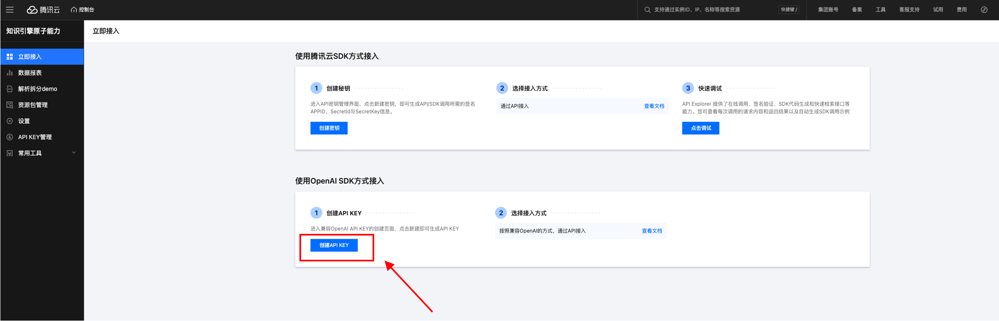

3. Copy the generated **API Key**

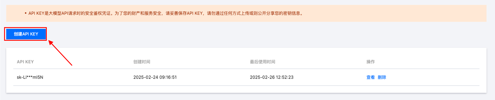
4. In OpenChat, go to **Settings** → **Tencent Cloud**, and paste the API Key

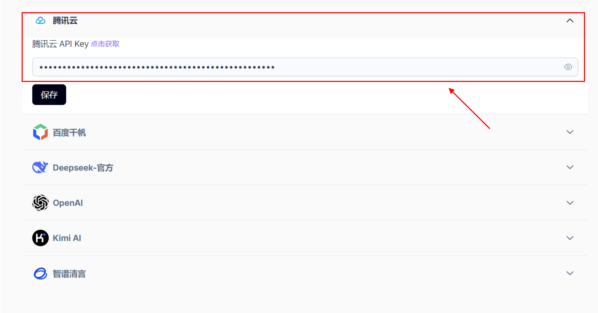

5. Click **Save** ✅

#### Model Download
After setting up, check your network connection and download the required models by clicking `Settings` in the lower left corner.

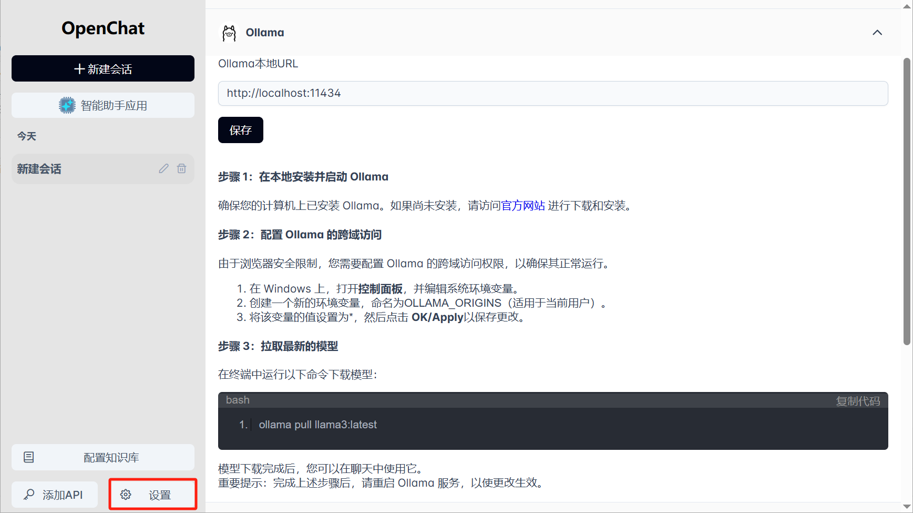

Network retrieval and knowledge base functions require local **Ollama embedded models**. Click Ollama in the model management section and follow the instructions to download the model.

#### 🔽 Download & Install Ollama
- Visit [Ollama Official Website](https://ollama.com/download) to download and install.
- After installation, run the following command to verify the installation:
  ```sh
  ollama --version
  ```
  If a version number is displayed, the installation was successful ✅

#### 📥 Download & Deploy DeepSeek-R1 Model
 **Recommendation**: If your PC has limited resources, download a smaller parameter model.

- Run the following command in the terminal to download and start the model:
  ```sh
  ollama run deepseek-r1:1.5b
  ```
- Other DeepSeek-R1 models:
  ```sh
  ollama run deepseek-r1:7b   # 7B version
  ollama run deepseek-r1:8b   # 8B version
  ollama run deepseek-r1:14b  # 14B server version
  ollama run deepseek-r1:32b  # 32B server version
  ollama run deepseek-r1:70b  # 70B server version
  ```
- More models can be found at: [Ollama Library](https://ollama.com/library)
- **Download time** is proportional to **model size** ☕
- **Inference speed** is inversely proportional to **model size** 🏎

✅ **When the terminal displays `success`, the model is ready for use**

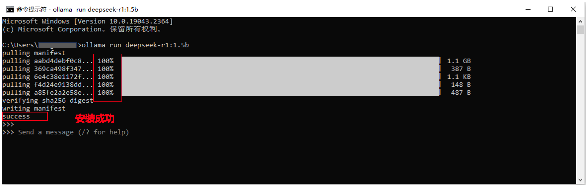

**Note:**
* If the download fails, it may be due to network issues. Retry after restoring the connection.
* Large model downloads depend on network speed and may take time.

<br>

#### ⚙️ Configuring Ollama in OpenChat
##### **Method 1: Directly Configure API in OpenChat**


1. In OpenChat, click **“Add API”** in the lower-left corner
2. Select **Ollama**, keep the default `Ollama Local URL`
3. Click **Save** ✅

##### **Method 2: Configure in OpenChat Settings**

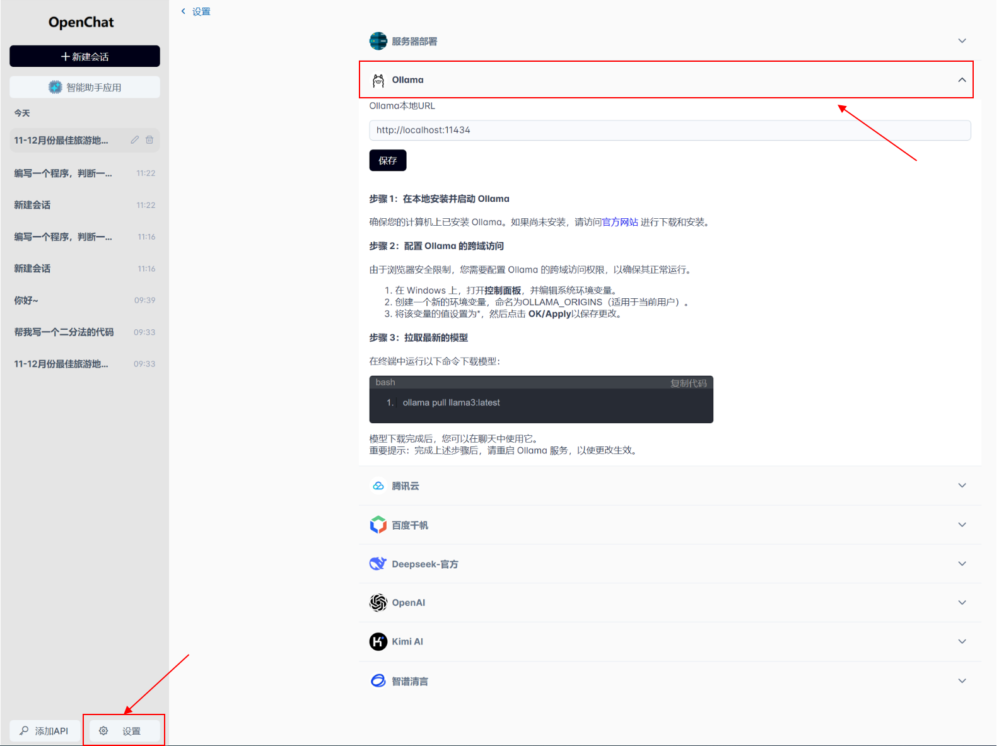

1. Click **Settings** in the lower-left corner
2. Select **Ollama** as the AI model
3. Click **Save** ✅

---
### Using Server-Hosted Models in OpenChat (Optional)

#### Server Deployment Requirements
1. **Prepare a server or cluster** (Recommended: **Inspur YuanBrain R1 Inference Server**)
2. **Deploy DeepSeek or other AI models**
3. **Expose the API service** (Recommended: [OpenStation](https://openstation.com))

#### Configuring OpenChat to Connect to Server Models
- **Go to OpenChat Settings** → **Enter Server API URL and API Key**

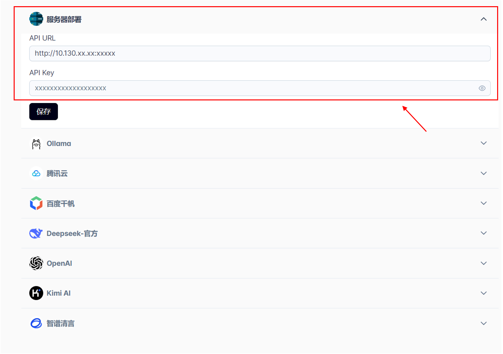

- **Select `DeepSeek-Local` in the chat interface** (or your deployed service)
- **Choose the model** and start chatting 🚀

---

### Step 2: Start Conversational AI

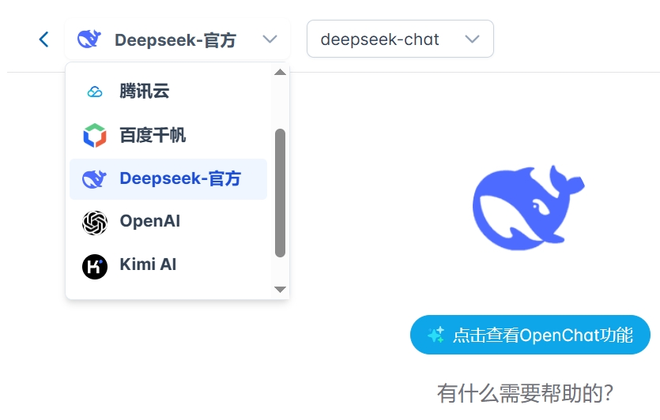

Once the API key is saved, go to the chat interface, select a model from the dropdown, and start your AI-powered conversation.

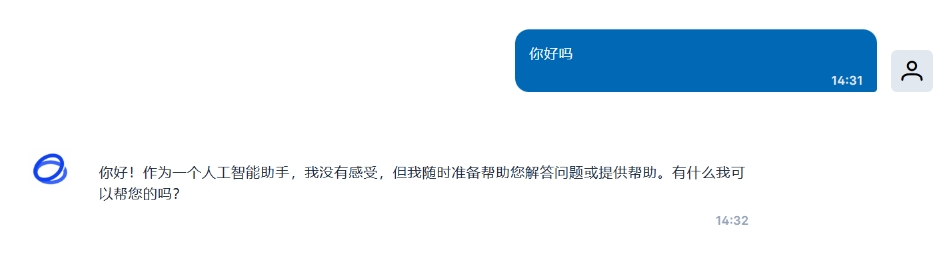

---


### Step 3: Applying Conversation Plugins

You can select **various conversation plugins** above the chat input box, including **Sensitive Content Detection, Web Search, Knowledge Base, and Document Interaction**.

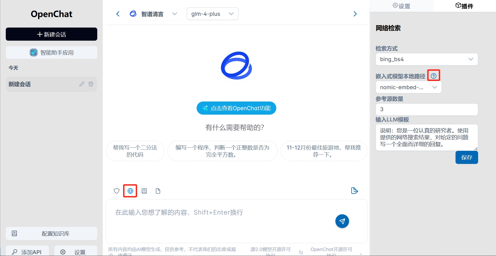

After entering the Q&A interface, follow the steps below to use the plugins.

#### Steps:

① **Enable a plugin** (Sensitive Content Detection/Web Search/Knowledge Base/Document Interaction). In the example image above, the **Web Search plugin** is selected. The plugin turns **blue** when activated. At any given time, only **one plugin** can be active.

② **Select the right-side plugin panel** to display the plugin configuration settings. Fill in the necessary configuration details as required.

③ **Choose an available embedding model** from the dropdown menu. If the menu is empty, it means no available models exist. Click the **question mark icon** to follow the guide and download a compatible model.

④ **Save the plugin configuration** to activate it within the conversation interface.

Once configured, the selected plugin will be active during your OpenChat conversations, enhancing the overall experience with intelligent capabilities tailored to your needs.

---

### Step 4: Applying the Knowledge Base

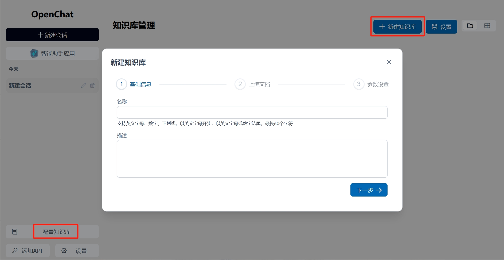

To build a **personal knowledge base**, click on the knowledge base icon, create a new knowledge base, and enter an **English** name for your personal knowledge base.

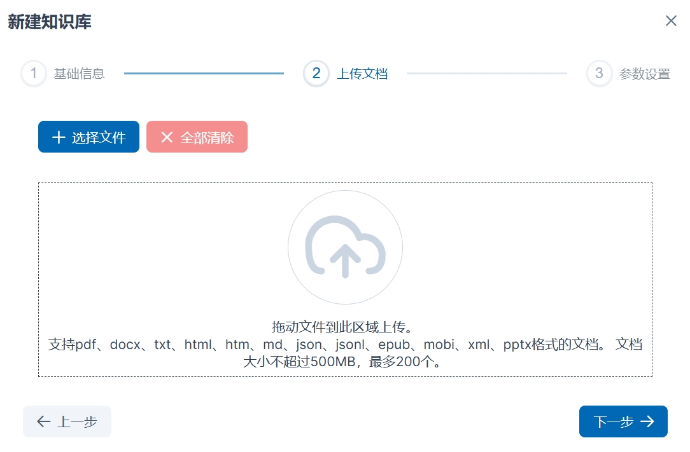

Upload documents using the **directory selection method** or drag and drop local files into the designated area. The system supports multiple document formats, so ensure that you choose the correct file format for upload.

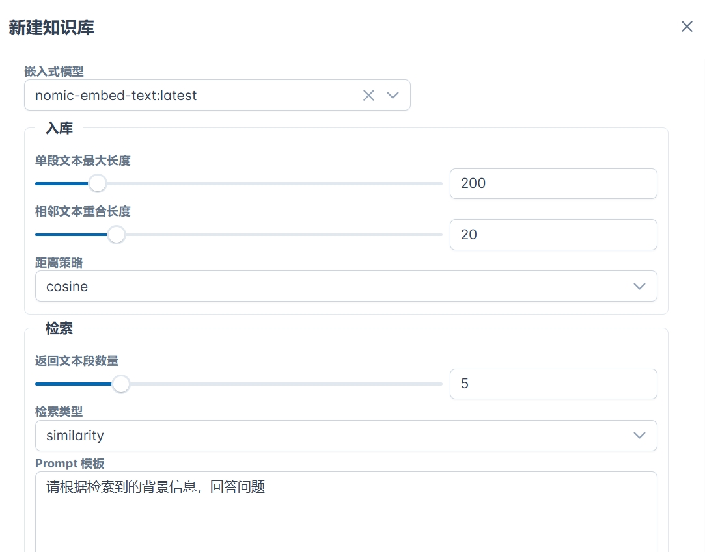

Select an **embedding model**, and choose **storage and retrieval configurations**. If no models are available in the embedding model list, please refer to **Step 5** to configure it. Once done, click **Create** to complete the setup.

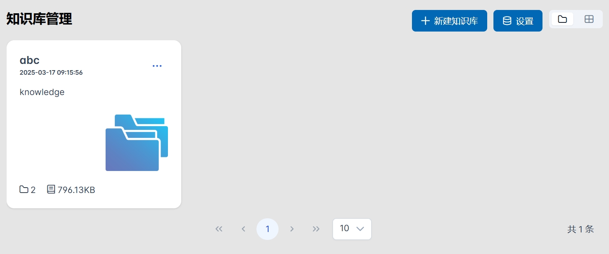

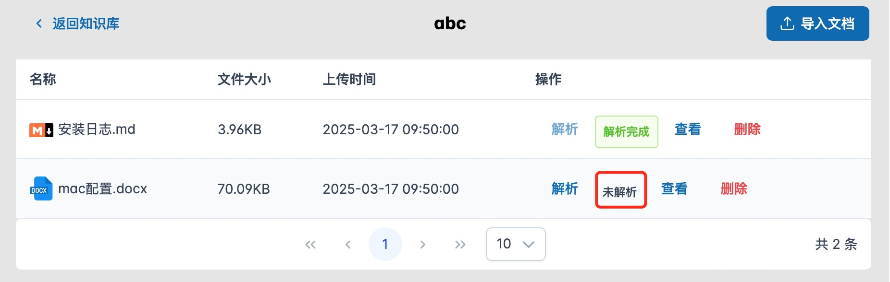

After the knowledge base is successfully created, it will appear in the **Knowledge Base Management** panel. Click to enter the knowledge base, where uploaded files will initially remain **unprocessed**. Click **Parse** to start processing the files. Once parsing is completed, the system will display the message **"Parsing Completed"**.

If you need to add more documents, click the **"Import Documents"** button in the upper-right corner to upload additional files.

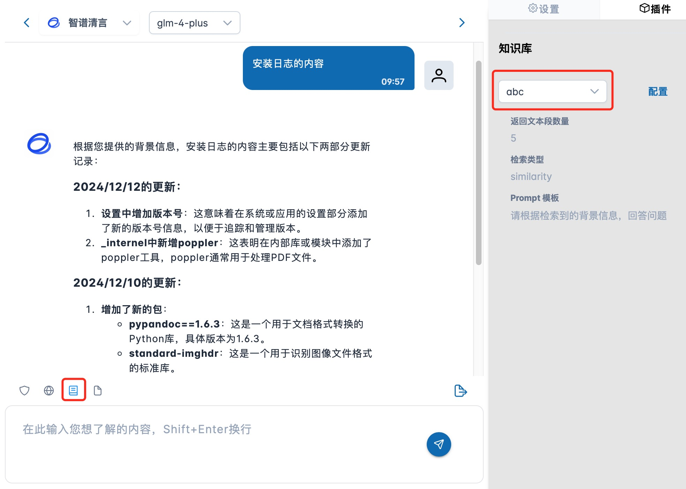

In the chat interface, enable the **Knowledge Base Plugin** and select the newly created knowledge base. You can now retrieve and query information from your personal knowledge base during interactive conversations.

---

### Step 5: AI Assistant Applications

OpenChat integrates multiple AI model providers. Click **AI Assistants** in the sidebar to explore available services.

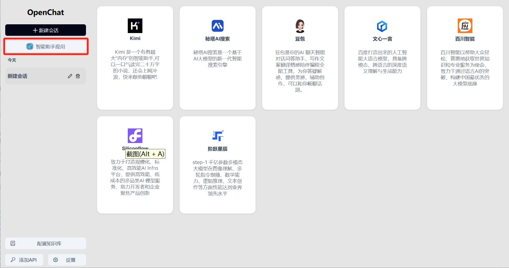

Example: Clicking on **Doubao** will take you to its official website for full functionality.

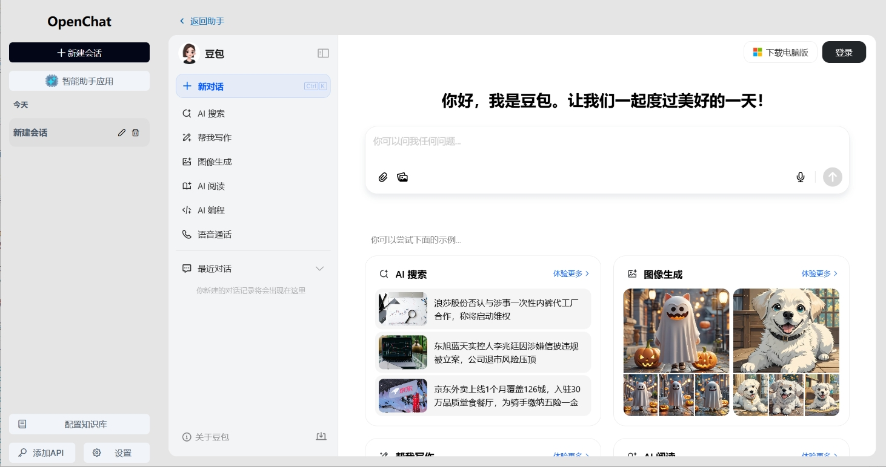

---

### 🔄 Feature Upgrades

#### 1. Enhanced Knowledge Base
- Supports **more document types**
- Improved parsing for scanned PDFs

#### 2. Improved Web Search
- Now supports **Bing Search** in addition to Serper API

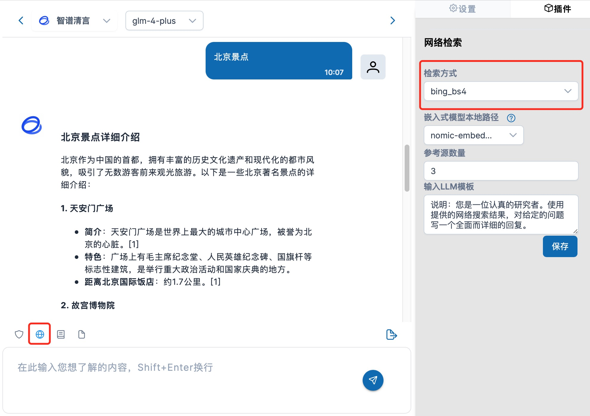

#### 3. Chat Features
- **Grouped conversations** by date
- **Regenerate responses** if unsatisfied
- **Delete conversations** permanently

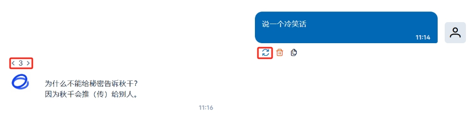

---

🚀 **Start using OpenChat today and experience the power of AI!**
