<p align="left">
  <a href="../../README.md">Back</a>

# OpenChat User Guide

## 📚 Table of Contents

- [Step 1: Configuring the OpenChat Client](#step-1-configuring-the-openchat-client)
  - [API Application](#api-application)
  - [Supported Cloud-based AI Services](#️-currently-supported-cloud-based-ai-services)
  - [Model Download](#model-download)
  - [Download & Deploy Ollama](#download--install-ollama)
  - [Configure Ollama in OpenChat](#️-configuring-ollama-in-openchat)
  - [Using Server-Hosted Models (Optional)](#using-server-hosted-models-in-openchat-optional)
- [Step 2: Start Conversational AI](#step-2-start-conversational-ai)
- [Step 3: Applying Conversation Plugins](#step-3-applying-conversation-plugins)
- [Step 4: Applying the Knowledge Base](#step-4-applying-the-knowledge-base)
- [Step 5: AI Assistant Applications](#step-5-ai-assistant-applications)
- [📘 OpenChat v1.0.2 New Feature User Guide](#-openchat-v102-new-feature-user-guide)
  - [🤖 Agent Feature Guide](#-1-agent-feature-guide)
    - [Create a Custom Agent](#1-create-a-custom-agent)
    - [Use Built-in Assistants](#2-use-built-in-assistants)
    - [Agent Interaction and Management](#3-agent-interaction-and-management)
  - [🌍 Immersive Translation Guide](#-2-immersive-translation-guide)
    - [Enter AI Translation Page](#1-enter-the-ai-translation-page)
    - [Document Translation Workflow](#2-document-translation-workflow)
    - [Synchronized View & Display Control](#3-synchronized-view--display-control)
    - [Text Translation Module](#4-text-translation-module)
  - [⚙️ Auto-Update Feature](#-3-auto-update-feature)
    - [How It Works](#how-it-works)
    - [🔄 Feature Upgrades](#-feature-upgrades)

---

### Step 1: Configuring the OpenChat Client
Before using OpenChat's conversational AI features, you need to apply for an API and download the models.

#### API Application

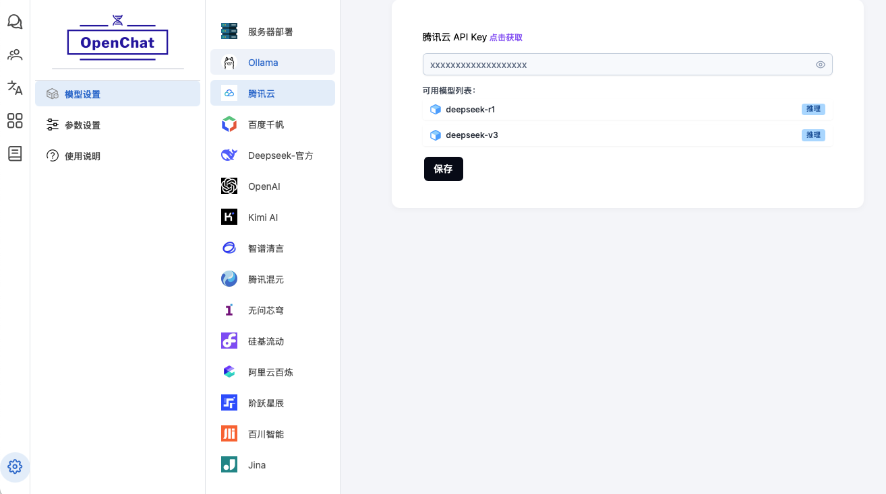

Click the `Settings` icon in the lower left corner to enter the `Model Management` interface.

OpenChat now supports multiple cloud-based large models. Before using the services of different AI providers, you need to configure API access. Click `Get API` to visit the providers' official websites and follow the steps to apply for an API key.

### ☁️ Currently Supported Cloud-based AI Services
OpenChat supports multiple **cloud-based AI models** that can be quickly integrated via API:

| Platform | API Application Link |
|----------|--------------------------------|
| **DeepSeek** | [Apply for API](https://platform.deepseek.com/api_keys) |
| **Tencent Cloud** | [Apply for API](https://console.cloud.tencent.com/lkeap) |
| **Baidu Qianfan** | [Apply for API](https://console.bce.baidu.com/iam/#/iam/apikey/list) |
| **Zhipu Qingyan** | [Apply for API](https://www.bigmodel.cn/usercenter/proj-mgmt/apikeys) |
| **Kimi (Moonshot AI)** | [Apply for API](https://platform.moonshot.cn/console/api-keys) |
| **OpenAI (ChatGPT)** | [Apply for API](https://platform.openai.com/settings/organization/api-keys) |

### Configuring OpenChat Client
#### **Example: Configuring Tencent Cloud API**
1. Visit [Tencent Cloud LKEAP](https://console.cloud.tencent.com/lkeap)
2. Register & log in, then click **Create API Key**

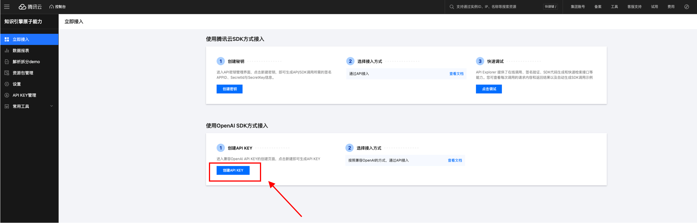

3. Copy the generated **API Key**

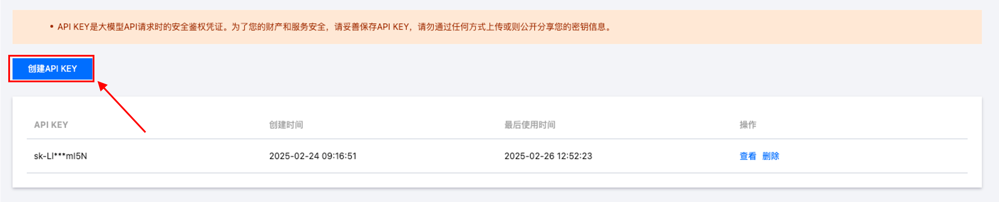
4. In OpenChat, go to **Settings** → **Tencent Cloud**, and paste the API Key

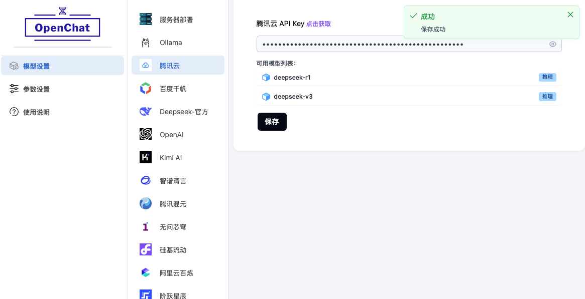

5. Click **Save** ✅

#### Model Download
After setting up, check your network connection and download the required models by clicking `Settings` in the lower left corner.

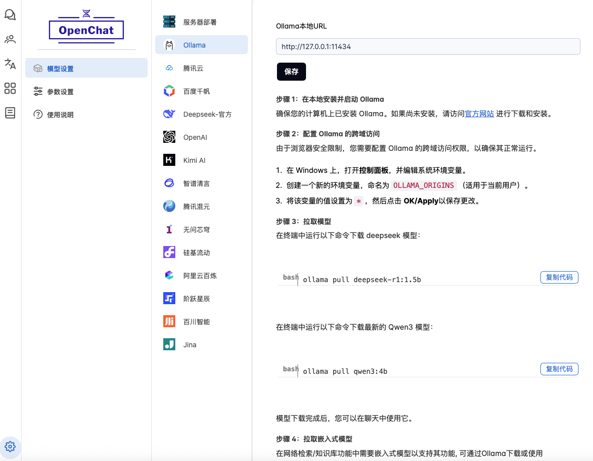

Network retrieval and knowledge base functions require local **Ollama embedded models**. Click Ollama in the model management section and follow the instructions to download the model.

#### 🔽 Download & Install Ollama
- Visit [Ollama Official Website](https://ollama.com/download) to download and install.
- After installation, run the following command to verify the installation:
  ```sh
  ollama --version
  ```
  If a version number is displayed, the installation was successful ✅

#### 📥 Download & Deploy DeepSeek-R1 Model
 **Recommendation**: If your PC has limited resources, download a smaller parameter model.

- Run the following command in the terminal to download and start the model:
  ```sh
  ollama run deepseek-r1:1.5b
  ```
- Other DeepSeek-R1 models:
  ```sh
  ollama run deepseek-r1:7b   # 7B version
  ollama run deepseek-r1:8b   # 8B version
  ollama run deepseek-r1:14b  # 14B server version
  ollama run deepseek-r1:32b  # 32B server version
  ollama run deepseek-r1:70b  # 70B server version
  ```
- More models can be found at: [Ollama Library](https://ollama.com/library)
- **Download time** is proportional to **model size** ☕
- **Inference speed** is inversely proportional to **model size** 🏎

✅ **When the terminal displays `success`, the model is ready for use**

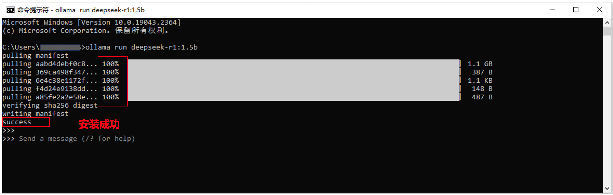

**Note:**
* If the download fails, it may be due to network issues. Retry after restoring the connection.
* Large model downloads depend on network speed and may take time.

<br>

#### ⚙️ Configuring Ollama in OpenChat
##### **Method 1: Directly Configure API in OpenChat**

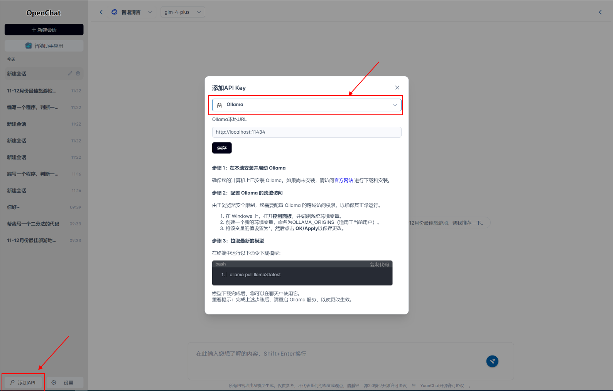

1. In OpenChat, click **“Add API”** in the lower-left corner
2. Select **Ollama**, keep the default `Ollama Local URL`
3. Click **Save** ✅

##### **Method 2: Configure in OpenChat Settings**

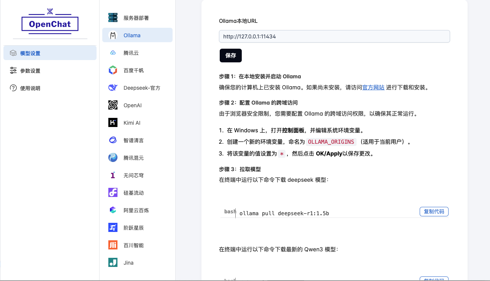

1. Click **Settings** in the lower-left corner
2. Select **Ollama** as the AI model
3. Click **Save** ✅

---
### Using Server-Hosted Models in OpenChat (Optional)

#### Server Deployment Requirements
1. **Prepare a server or cluster** 
2. **Deploy DeepSeek or other AI models**
3. **Expose the API service** (Recommended: [OpenStation](https://openstation.com))

#### Configuring OpenChat to Connect to Server Models
- **Go to OpenChat Settings** → **Enter Server API URL and API Key**

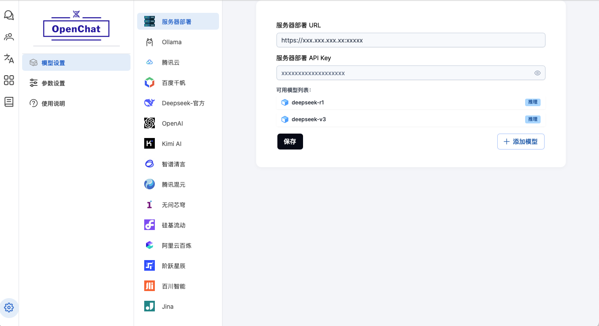

- **Select `DeepSeek-Local` in the chat interface** (or your deployed service)
- **Choose the model** and start chatting 🚀

---

### Step 2: Start Conversational AI

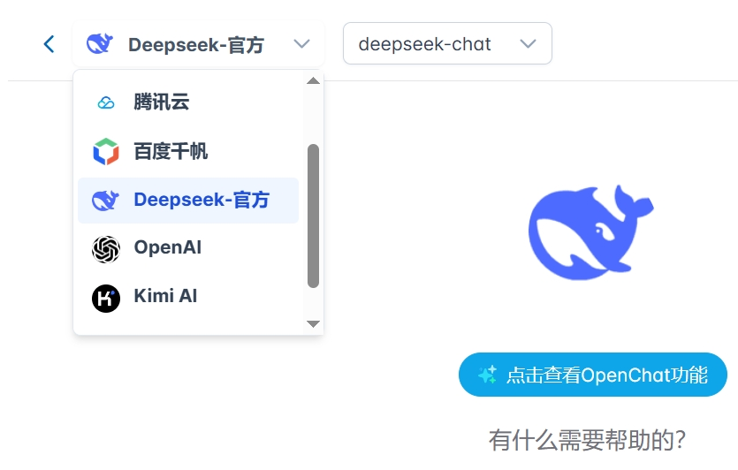

Once the API key is saved, go to the chat interface, select a model from the dropdown, and start your AI-powered conversation.

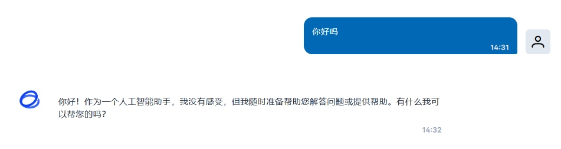

---


### Step 3: Applying Conversation Plugins

You can select **various conversation plugins** above the chat input box, including **Sensitive Content Detection, Web Search, Knowledge Base, and Document Interaction**.

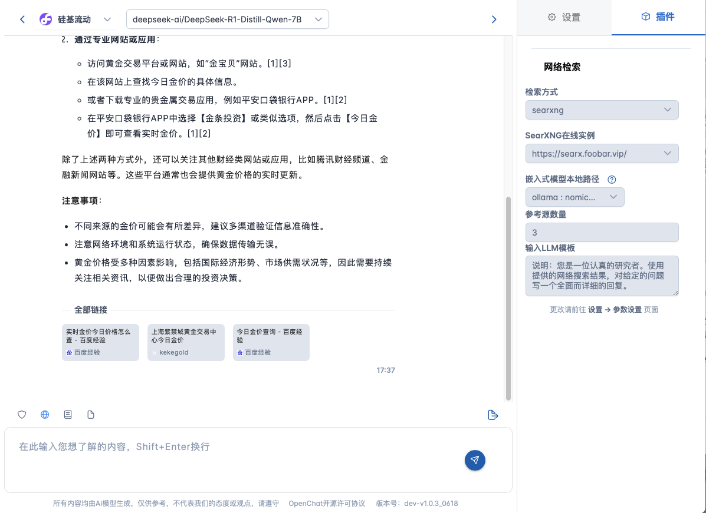

After entering the Q&A interface, follow the steps below to use the plugins.

#### Steps:

① **Enable a plugin** (Sensitive Content Detection/Web Search/Knowledge Base/Document Interaction). In the example image above, the **Web Search plugin** is selected. The plugin turns **blue** when activated. At any given time, only **one plugin** can be active.

② **Select the right-side plugin panel** to display the plugin configuration settings. Fill in the necessary configuration details as required.

③ **Choose an available embedding model** from the dropdown menu. If the menu is empty, it means no available models exist. Click the **question mark icon** to follow the guide and download a compatible model.

④ **Save the plugin configuration** to activate it within the conversation interface.

Once configured, the selected plugin will be active during your OpenChat conversations, enhancing the overall experience with intelligent capabilities tailored to your needs.

---

### Step 4: Applying the Knowledge Base

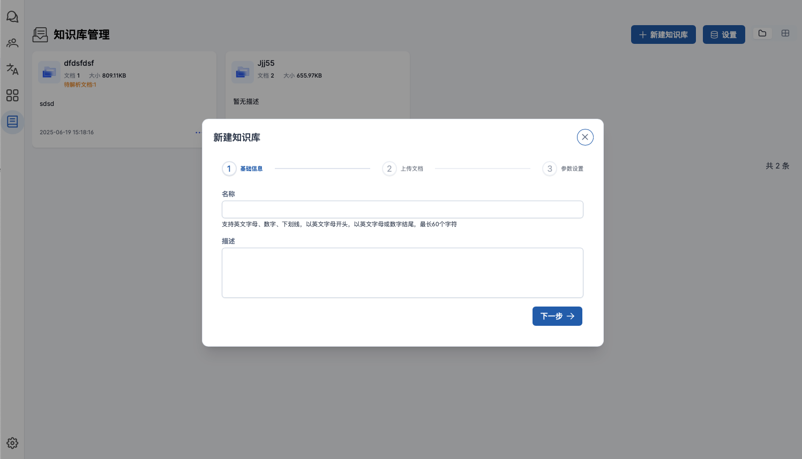

To build a **personal knowledge base**, click on the knowledge base icon, create a new knowledge base, and enter an **English** name for your personal knowledge base.

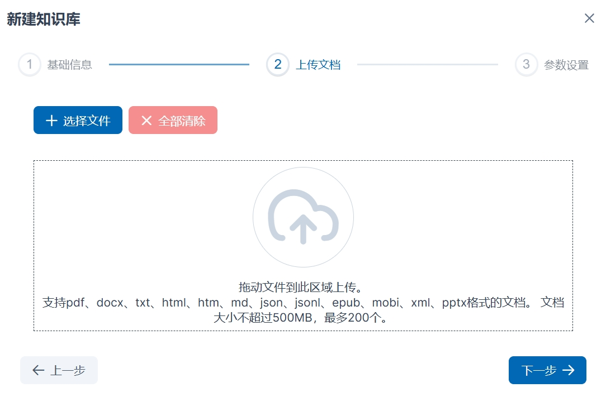

Upload documents using the **directory selection method** or drag and drop local files into the designated area. The system supports multiple document formats, so ensure that you choose the correct file format for upload.

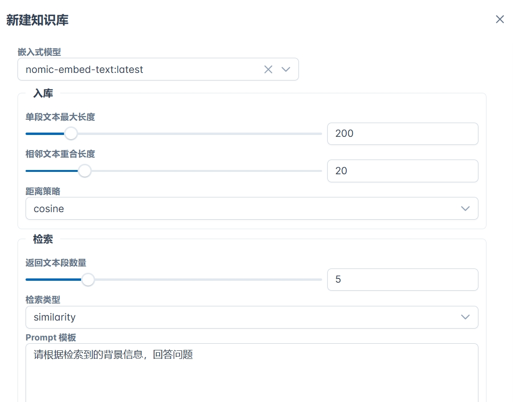

Select an **embedding model**, and choose **storage and retrieval configurations**. If no models are available in the embedding model list, please refer to **Step 3** to configure it. Once done, click **Create** to complete the setup.

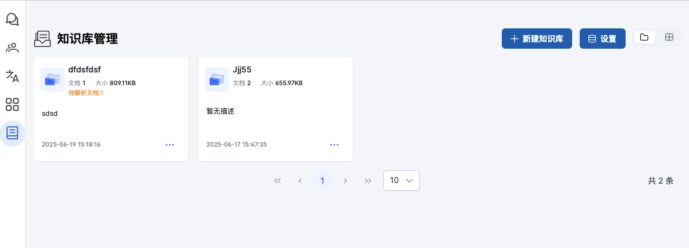

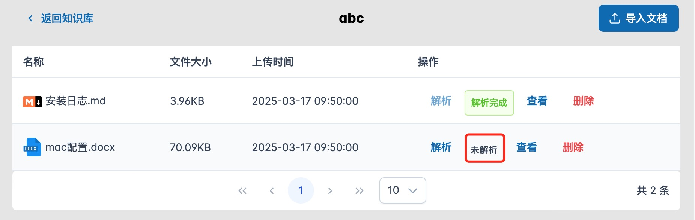

After the knowledge base is successfully created, it will appear in the **Knowledge Base Management** panel. Click to enter the knowledge base, where uploaded files will initially remain **unprocessed**. Click **Parse** to start processing the files. Once parsing is completed, the system will display the message **"Parsing Completed"**.

If you need to add more documents, click the **"Import Documents"** button in the upper-right corner to upload additional files.

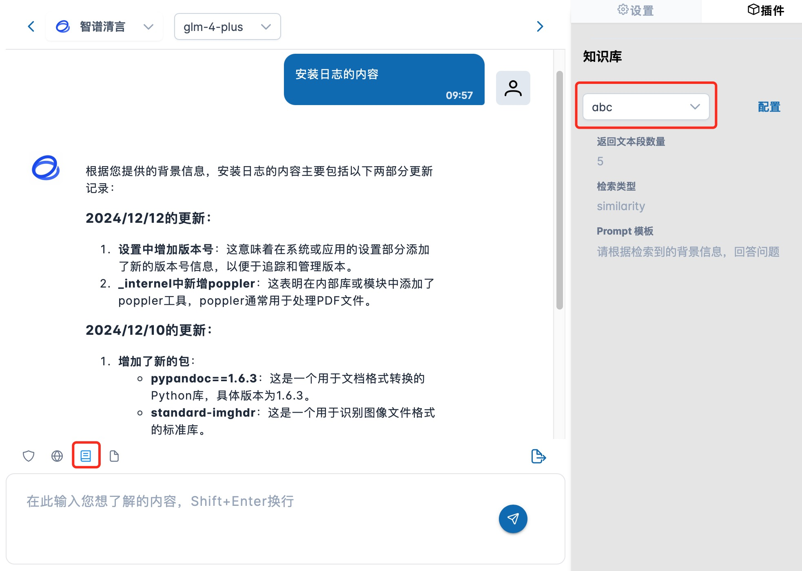

In the chat interface, enable the **Knowledge Base Plugin** and select the newly created knowledge base. You can now retrieve and query information from your personal knowledge base during interactive conversations.

---

### Step 5: AI Assistant Applications

OpenChat integrates multiple AI model providers. Click **AI Assistants** in the sidebar to explore available services.

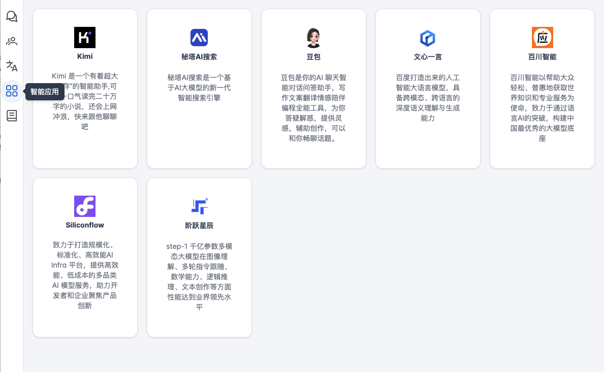

Example: Clicking on **Doubao** will take you to its official website for full functionality.

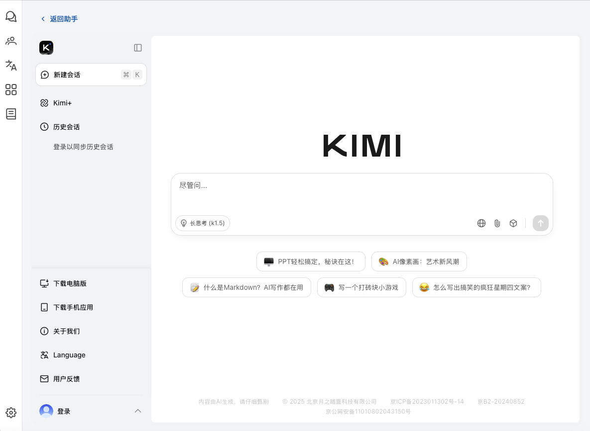

---
# 📘 OpenChat v1.0.2 New Feature User Guide

---

## 🤖 1. Agent Feature Guide

OpenChat v1.0.2 introduces the **Agent System**, allowing users to create personalized agents or quickly activate built-in assistants for a more tailored experience.

### 1. Create a Custom Agent

1. Click on the **Agent** section in the left sidebar.
2. Click the **New** button in the top right corner to enter the creation page.
3. Fill in the following fields:
   - **Name**: Give your agent a name
   - **Category**: Select or create a category
   - **System Prompt**: Define the agent's role and behavior
   - **Tags (optional)**: Add keywords for filtering

4. Click **Create** to finish creating your agent.

📷 Example interface:  


---

### 2. Use Built-in Assistants

1. Go to the **Agent** section on the left
2. In the “Add Assistant” area, select from multiple pre-built agents
3. Click on an assistant card (e.g., Coding Assistant, Learning Assistant)
4. The system will apply the preset prompt and open a dedicated session

📷 Example of built-in agent selection:  


---

### 3. Agent Interaction and Management

- Each agent has a dedicated chat space with support for:
  - Model switching
  - Viewing conversation history
  - Context management toggle
- Use tags to filter, edit, or delete agents easily

📷 Agent chat interface example:  
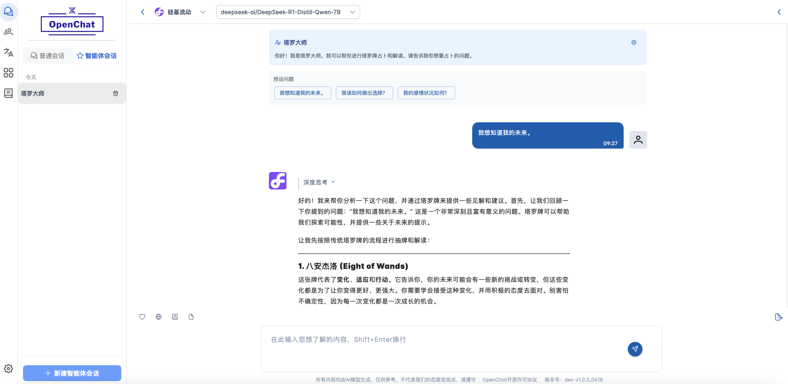

---

## 🌍 2. Immersive Translation Guide

OpenChat v1.0.2 introduces a powerful **Immersive Translation** feature, supporting multilingual translation of both documents and plain text.

### 1. Enter the AI Translation Page

- Click **AI Translation** in the sidebar to open the translation interface.

---

### 2. Document Translation Workflow

1. Click **Upload File** on the left and select a PDF/DOCX/TXT file.
2. Uploaded files will appear in the “File Translation History” list on the left with status and preview.
3. Click a file card to preview its original content on the right.
4. Click **Translate Now** to start translation.
5. Once completed, the translated content will appear on the right.

📷 Full translation layout (left: file list, right: translated view):  
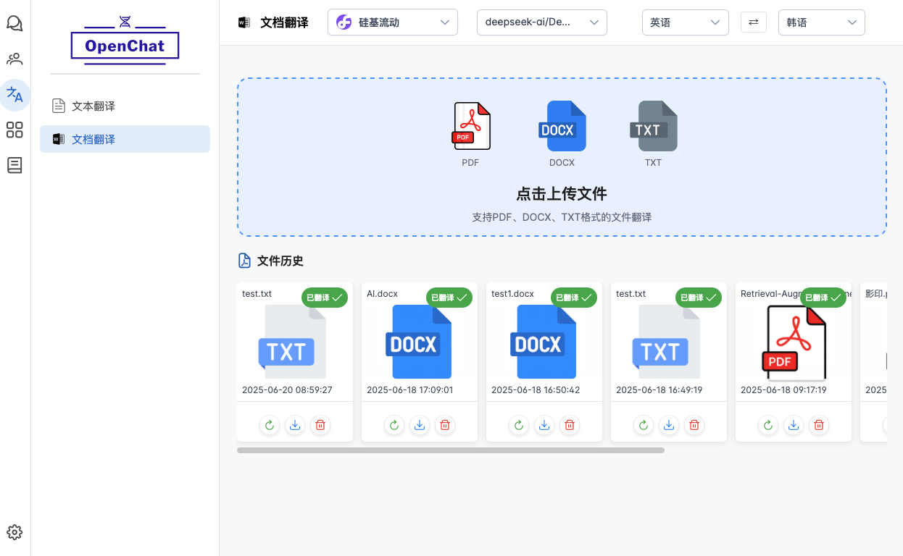

---

### 3. Synchronized View & Display Control

📷 File translation interface:  
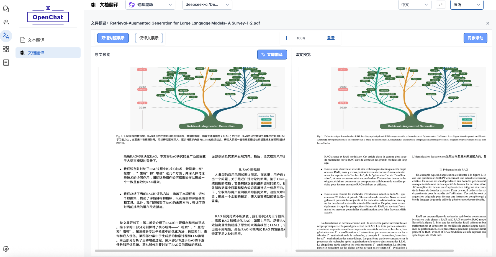

After translation, you can:

- ✅ **Sync Scroll**: Scroll original and translated texts in sync for easier comparison
- ✅ **Show Translation Only**: Hide the original and display only translated content

---

### 4. Text Translation Module

- Located on the right-hand side for direct text input or paste.
- Supports translation between Chinese, English, Japanese, French, and Korean.
- Extra features include:
  - **Glossary Configuration**: Define terms for consistent translations
  - **Translation History**: Review past translations for reuse

---

## ⚙️ 3. Auto-Update Feature

OpenChat now supports automatic client updates. Users no longer need to manually download and install new versions.

📷 Auto-update notification popup:  
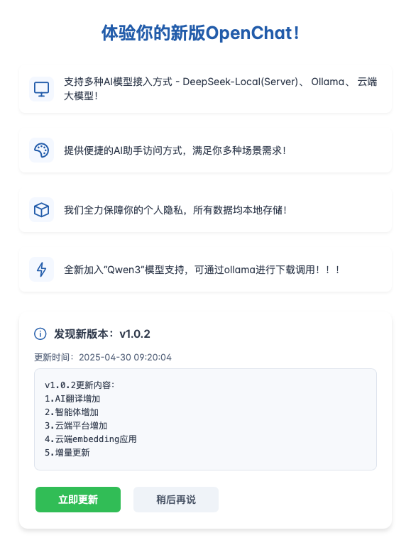

### How It Works:

- When a new version is available, the welcome screen will show a popup:
  - Includes version number, update time, and changelog
  - Offers two options: **Update Now** or **Remind Me Later**

- Clicking **Update Now** will:
  1. Download the latest version
  2. Replace the old application
  3. Relaunch OpenChat automatically  
     ⚠️ *macOS will prompt for permission—user authorization is required to proceed*

---

### 🔄 Feature Upgrades

#### 1. Enhanced Knowledge Base
- Supports **more document types**
- Improved parsing for scanned PDFs

#### 2. Improved Web Search
- Now supports **Bing Search** in addition to Serper API

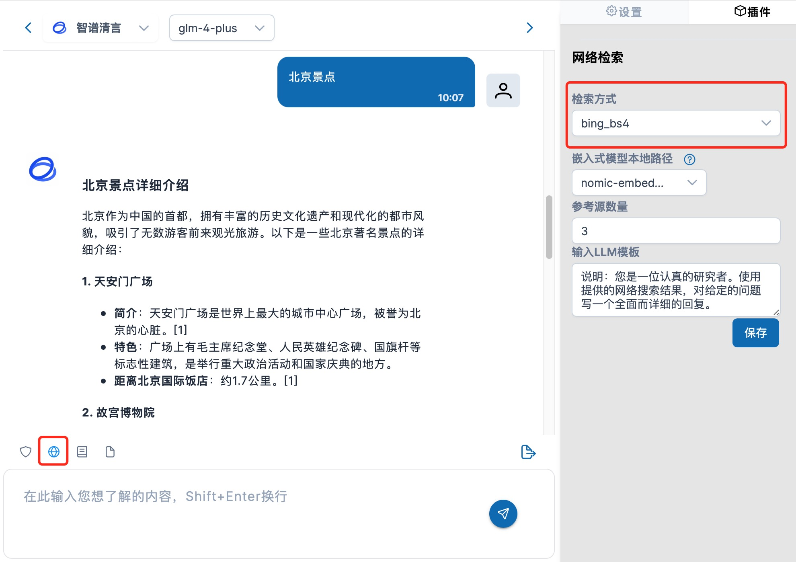

#### 3. Chat Features
- **Grouped conversations** by date
- **Regenerate responses** if unsatisfied
- **Delete conversations** permanently

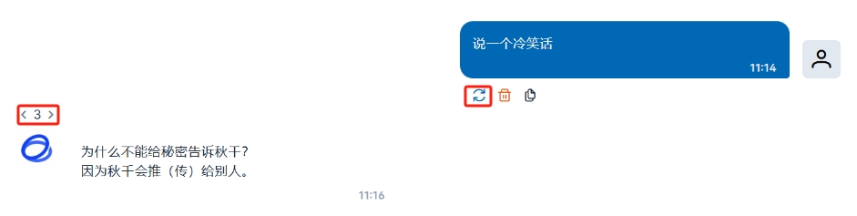

---

🚀 **Start using OpenChat today and experience the power of AI!**
