<p align="left">
  <a href="../../README.md">返回</a> 

# OpenChat使用指南

---

### 步骤1：OpenChat客户端配置
使用OpenChat对话交互能力前，需完成API申请和模型下载。

#### API申请

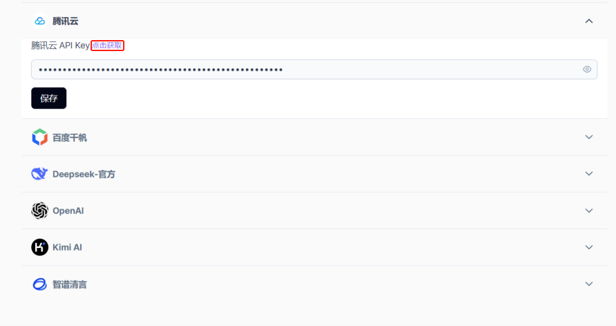

点击左侧下方图标`设置`，进入`模型管理`界面。

YuanChat 现已支持多个云端（Cloud）大模型服务接入，在使用各大模型供应商服务之前，可以通过 Cloud 平台提供的 API 服务实现，大模型的快速接入,在进行对话之前需要进行API的配置，通过`点击获取`进入各大供应商官网并按照步骤申请其API密钥

### ☁️ 目前支持的云端大模型服务
OpenChat 支持多种 **云端（Cloud）大模型**，可通过 API 快速接入：

| 平台 | API 申请链接 |
|------|--------------------------------|
| **DeepSeek** | [申请 API](https://platform.deepseek.com/api_keys) |
| **腾讯云** | [申请 API](https://console.cloud.tencent.com/lkeap) |
| **百度千帆** | [申请 API](https://console.bce.baidu.com/iam/#/iam/apikey/list) |
| **智谱清言** | [申请 API](https://www.bigmodel.cn/usercenter/proj-mgmt/apikeys) |
| **Kimi（月之暗面）** | [申请 API](https://platform.moonshot.cn/console/api-keys) |
| **OpenAI（ChatGPT）** | [申请 API](https://platform.openai.com/settings/organization/api-keys) |

###  配置 OpenChat 客户端
#### **示例：配置腾讯云 API**
1. 访问 [腾讯云 LKEAP](https://console.cloud.tencent.com/lkeap)
2. 注册 & 登录后，点击 **创建 API Key**

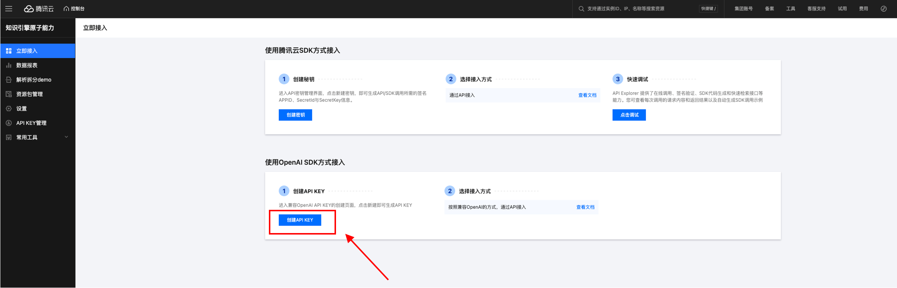


3. 复制生成的 **API Key**


4. 在 OpenChat **设置** → **腾讯云**，粘贴 API Key


5. 点击 **保存** ✅


#### 模型下载
完成设置后检查网络连接进行模型下载，点击左侧下方图标`设置`，进入`模型管理`界面。
<br>

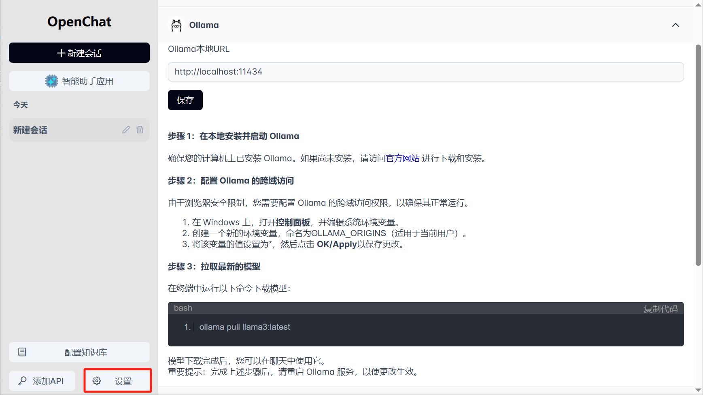

网络检索和知识库功能都需要本地Ollama嵌入模型的支持，请点击Ollama模型根据步骤进行ollama模型的下载。


#### 🔽 下载 & 安装 Ollama
- 访问 [Ollama 官网](https://ollama.com/download) 下载并安装
- 安装完成后，运行以下命令检查是否安装成功：
  ```sh
  ollama --version
  ```
  若显示版本信息，则表示安装成功 ✅

#### 📥 下载 & 部署 DeepSeek-R1 模型
 **建议**：如果 PC 硬件资源有限，建议下载小参数量模型

- 在终端中输入以下命令下载并运行模型：
  ```sh
  ollama run deepseek-r1:1.5b
  ```
- 其他 DeepSeek-R1 模型下载方式：
  ```sh
  ollama run deepseek-r1:7b   # 7B 版本
  ollama run deepseek-r1:8b   # 8B 版本
  ollama run deepseek-r1:14b  # 14B 服务器端
  ollama run deepseek-r1:32b  # 32B 服务器端
  ollama run deepseek-r1:70b  # 70B 服务器端
  ```
- 更多模型可参考：[Ollama Library](https://ollama.com/library)
- **模型下载时间** 与 **参数量** 成正比，请耐心等待 ☕
- **模型生成速度** 与 **参数量** 成反比，请选择合适的模型 🏎

✅ **当终端显示 `success`，表示模型已准备就绪**


**注意：**
* 如果显示下载失败，可能由于网络中断导致，恢复网络连接后，可自行恢复下载；
* 大模型下载速度取决于当前的网络状况，由于每个模型文件较大，需要耐心等待下载。

<br>

#### ⚙️ 在 OpenChat 中配置 Ollama
##### **方法 1：在 OpenChat 直接配置 API**

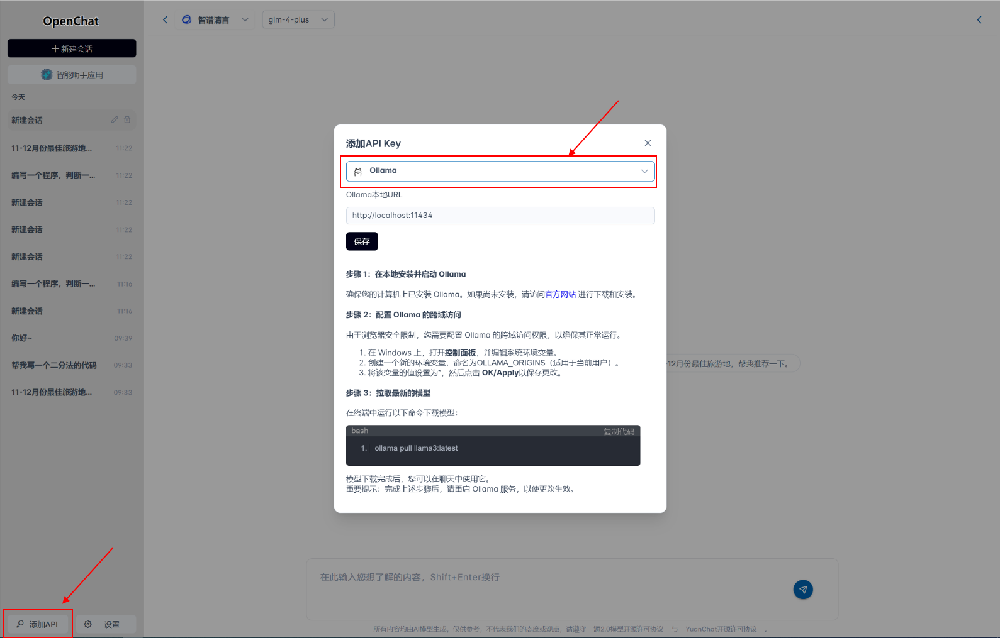

1. 在 OpenChat **左下角**，点击 **“添加 API”**
2. 选择 **Ollama**，保持默认 `Ollama 本地 URL`
3. 点击 **保存** ✅

##### **方法 2：在 OpenChat 设置中配置**

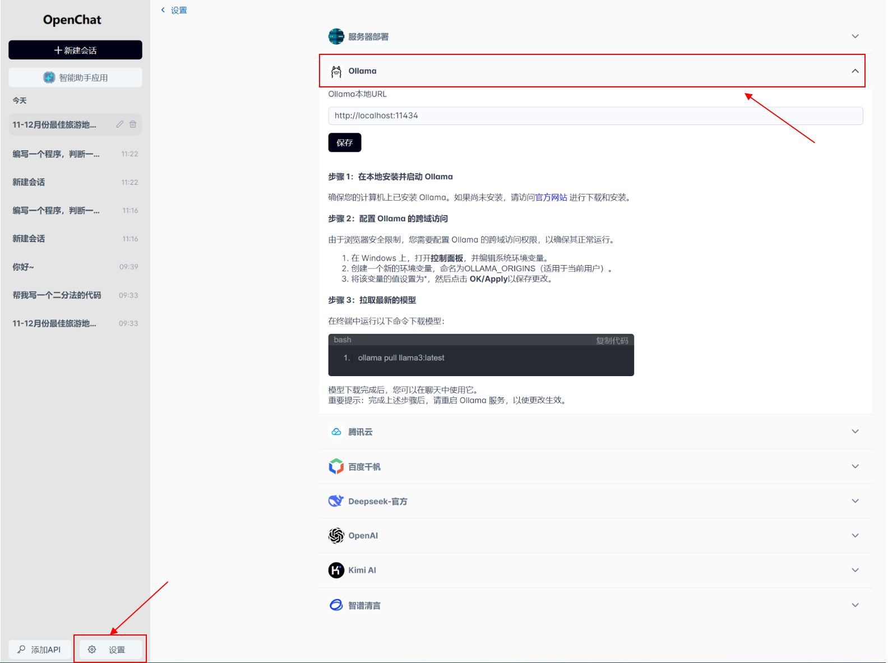

1. 点击 **左下角 “设置”**
2. 选择 **Ollama** 作为大模型
3. 点击 **保存** ✅

---
### 在 OpenChat 中使用服务器部署的大模型(可选)

####  服务器部署环境
1. **准备服务器或集群**（推荐 **浪潮信息-元脑 R1 推理服务器**）
2. **部署 DeepSeek 或其他大模型**
3. **发布推理 API 服务**（推荐 [OpenStation](https://openstation.com)）

####  配置 OpenChat 连接服务器端模型
- **在 OpenChat 设置** → **填写服务器 API URL 和 API Key**


- **在对话界面选择 `DeepSeek-本地`** (或你部署的服务)
- **选择具体模型**，即可开始对话 🚀

---

### 步骤2：使用模型进行进行交互式对话、问答

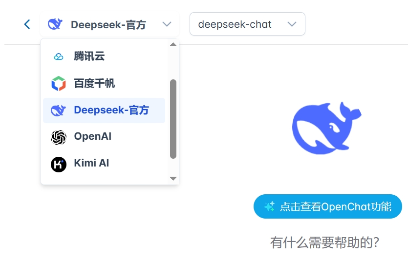


输入你申请的API密钥后，点击保存即可将您的API密钥保存在本地，返回对话界面，在右侧下拉框可选择可支持的模型名称，并在右侧选择相对应模型名称,随后即可与大模型进行问答


---

### 步骤3：应用对话插件
可在对话框上方选择其中通用插件包括敏感词检测、网络检索、知识库、文档对话.
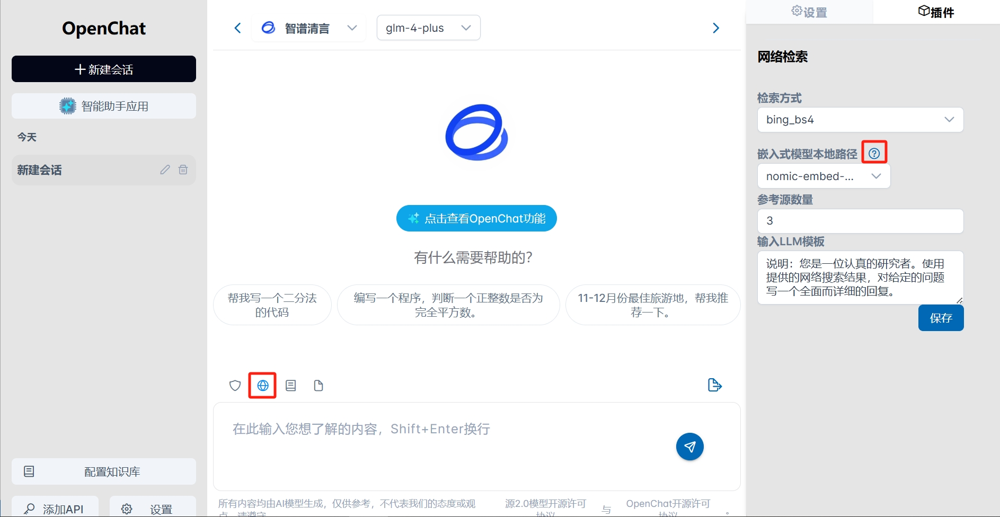
进入问答界面，按下图步骤使用插件功能。
步骤说明：
① 启用敏感词检测/网络检索/知识库/文档对话插件（图中以网络检索插件为例），`蓝色`表示插件选中状态，同一时刻只允许单一插件起作用；
② 选中右侧插件面板，展示插件配置信息，按需填入插件的配置信息；
③ 点击下拉菜单选择可用的嵌入式模型，如菜单为空，则没有可用的模型，可点击问号根据指引下载模型；
④ 保存插件配置信息即可在对话中启用插件功能。

---

### 步骤4：应用知识库
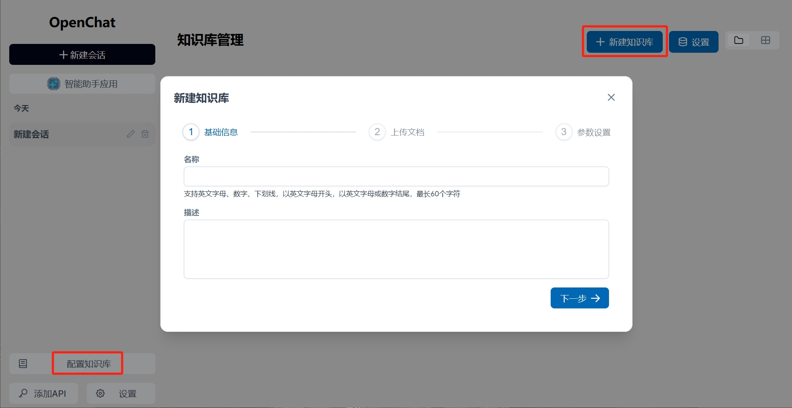
构建个人知识库，点击知识库图标，新建知识库，填入个人知识库`英文`名称；
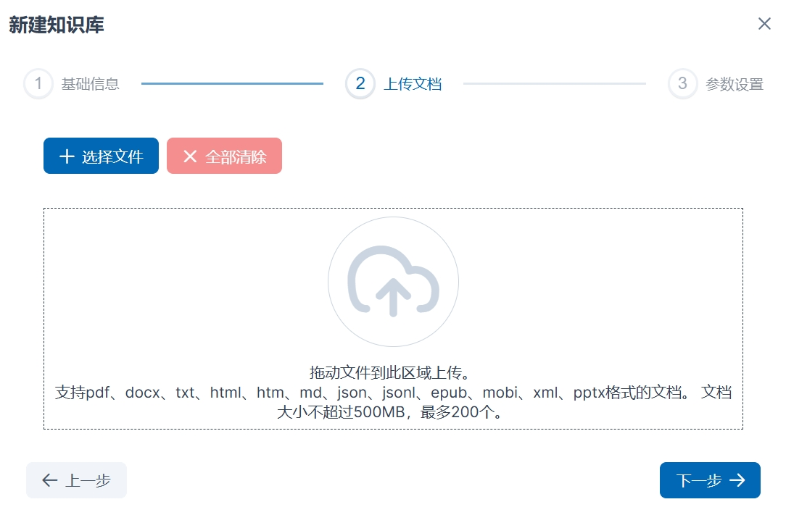
上传文档，可通过`目录方式`选择文件，也可直接将本地文件拖拽至图标区域上传，文件支持类型多样，请选择正确的文档格式进行上传；
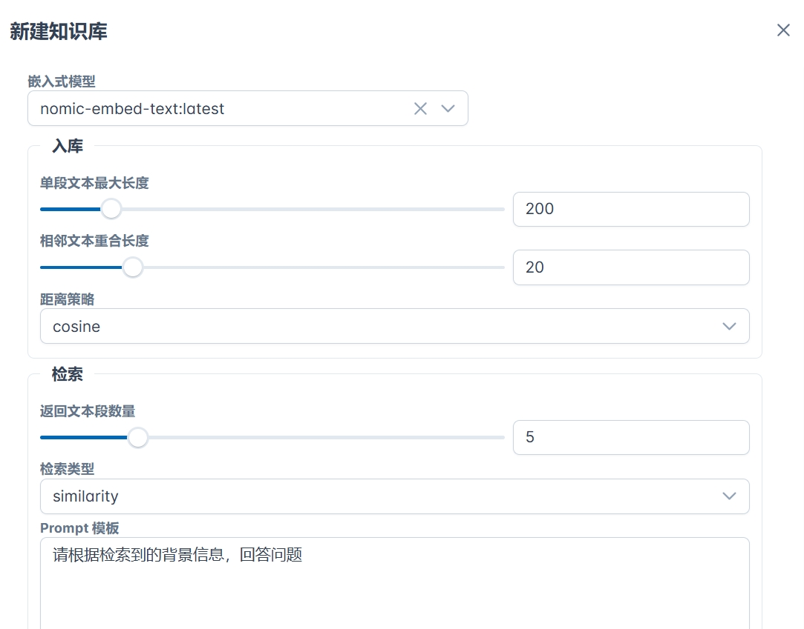
选择嵌入式模型，选择入库和检索配置，如嵌入式模型列表为空，请参考步骤5，配置完成后点击创建；


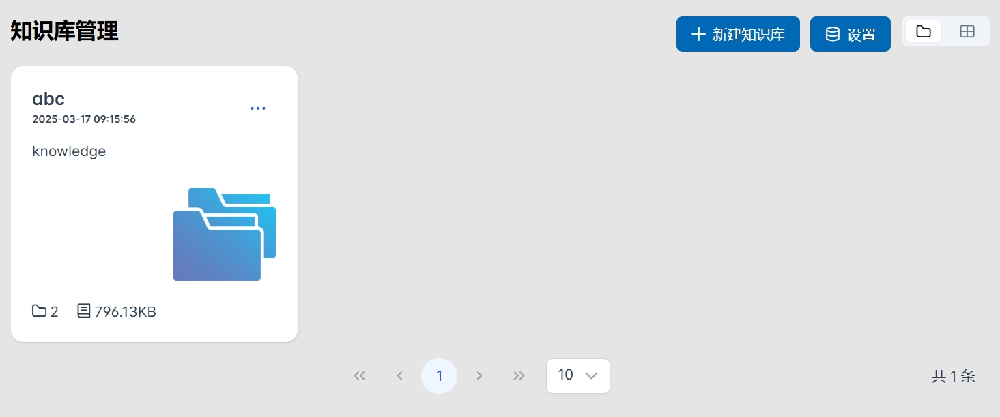

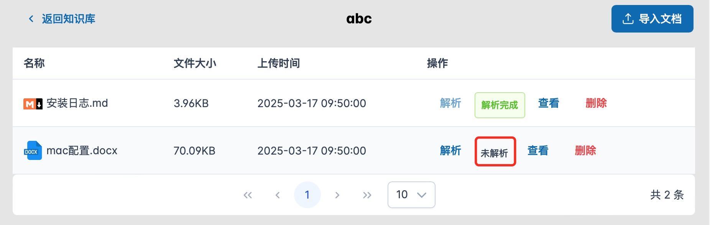


创建完成后可在知识库管理页面看到你所创建的知识库，点击进入知识库，此时文件还处于未解析状态，点击解析进行文件解析，解析完成后会出现`解析完成`字样，如果增加文档，可点击右上方`导入文档`进行文档上传。


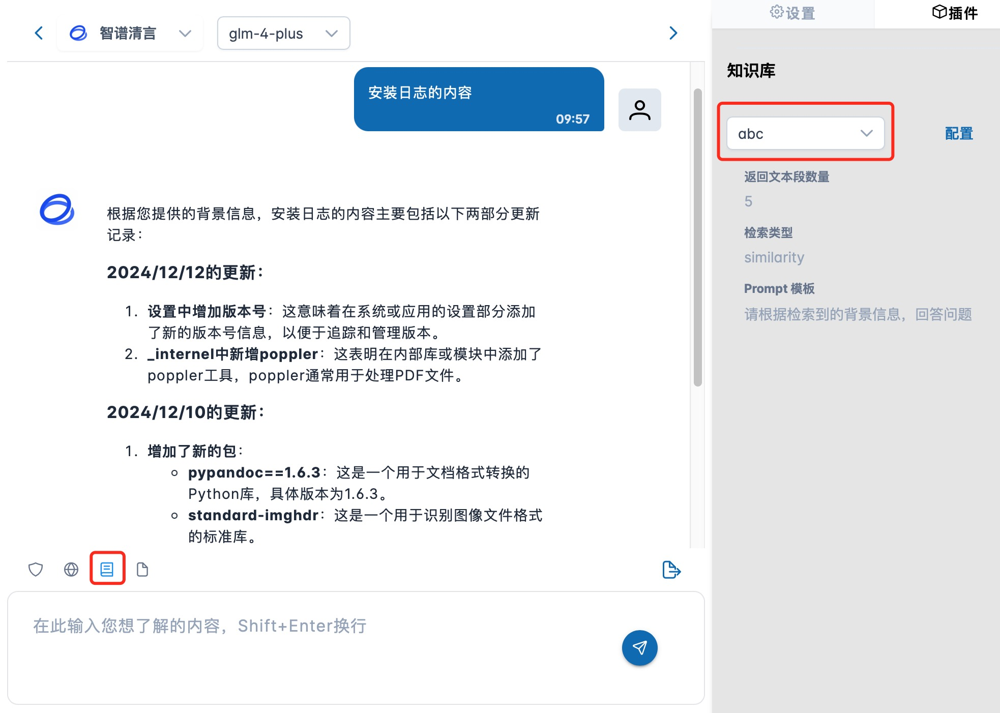


在对话界面启用知识库插件，选择创建完成的知识库，即可在交互界面中向个人知识库检索问答。

---

### 步骤5：智能助手应用

我们在OpenChat内集成了国内各大优秀厂商的大语言模型平台，在左侧边栏，点击智能助手应用，可进入智能助手应用界面，查看支持的大语言模型。

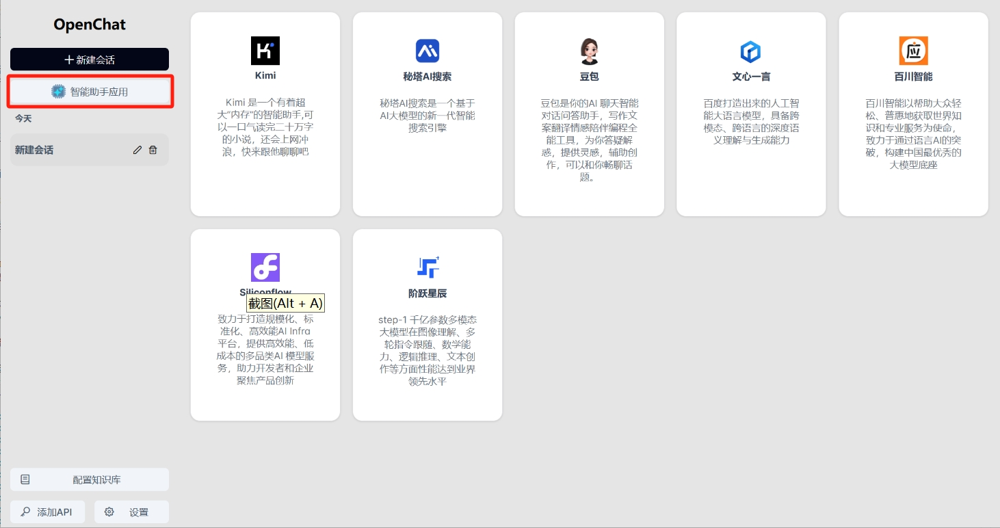

这里我们以豆包为例，点击豆包，即可进入豆包官网，使用豆包大模型的所有功能。

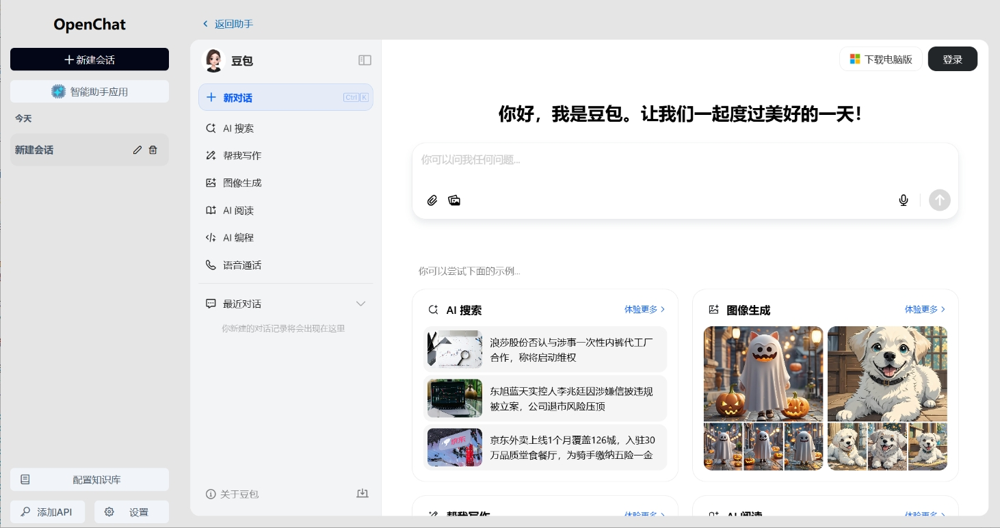

---

## 3.升级功能
### 3.1 提升知识库能力
本次升级，知识库新支持了多种文档类型，在新建知识库时，第二步上传文件时中，可以看到全部的支持的类型，具体文档类型包含：其中，`PDF支持影印版上传，但是不支持纯图片类型的docx上传`。如果纯图片类型的docx文档，需保存为PDF格式再进行上传。

### 3.2 增强网络检索能力
本次更新，增强了网络检索能力，支持了bing检索，可以选择Serper和bing两种方式进行检索增强，同时修复了bing检索存在的问题。
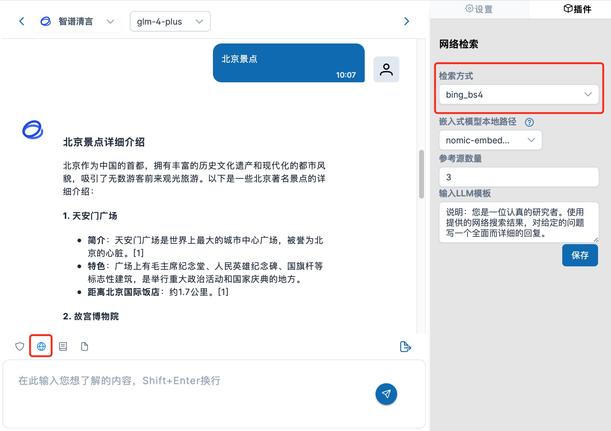
其中，Serper检索方式，需要准备搜索引擎服务Serper的API Key，通过`https://serpapi.com/`注册获取。

### 3.3 对话分组 | 重新生成 | 对话内容删除 
#### 3.3.1 对话分组
本版本，将对话，按照时间进行了分组，分为今天、最近3天、最近7天、最近30天、更早等组别，供用户进行方便查看，其中，可能有别个组别不存在，是用户在期间未进行过对话的原因导致。
#### 3.3.2 对话重新生成


新增对话重新生成功能，针对当前对话结果，如果用户不满意，可以重新生成对话，系统将重新生成对话结果；
重新生成的结果与前一次的结果同时存在，用户可以切换查看不同结果内容；
对话的历史记录中，如果存在不同结果，也会显示多个结果，可切换，供用户查看；

#### 3.7.3 对话内容删除


如果用户针对某次会话，觉得不满意，或者不想让其在对话历史中显示，可以将对话内容进行删除，删除后将不可见，也无法恢复。