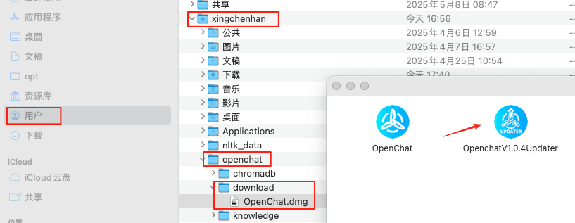
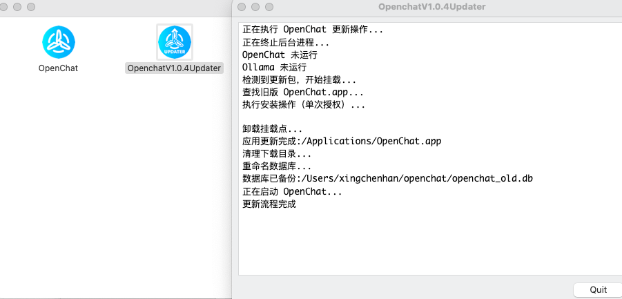

<p align="left">
  <a href="../../README.cn.md">返回</a> 

# 📦 OpenChat v1.0.4日志

### ✨ 新增功能

- 支持新模型 **Kimi-k2** 与 **Step-2**
- 新增平台接入：
  - 支持 **OpenRouter** 平台
  - 支持 **火山引擎** 平台
- 更多平台支持**自定义模型添加**，包括 OpenRouter / Jina / 百炼 等
- 支持 **自定义文件缓存目录**，缓存管理更灵活
- 新增 **服务器部署克隆功能**，一键复制部署配置，更高效地管理多实例部署

### 🛠️ 优化改进

- **PDF 翻译效果优化**，改善排版与渲染表现
- **对话文本选中功能优化**，复制操作更流畅
- **模型列表跳转设置**优化，可直接在下拉模型里面中点击 '模型设置’ 进入模型配置页面

---

### ⚠️ Mac 用户更新提示

我们注意到部分 macOS 用户在 v1.0.3 的在线更新过程中可能遇到如下问题：

> 下载完成后点击“立即重启”仍提示需要更新,实为更新失败未进行正常的更新流程。

请勿重复点击更新按钮，以免耽误您的宝贵时间。您可以手动完成更新：

#### 手动更新路径：



```

访达 -> 您的用户名/openchat/download/Openchat.dmg

```

打开dmg后，双击运行：

```

OpenchatV1.0.4Updater

```



即可完成手动更新。

---

感谢您一直以来对 OpenChat 的关注与支持！🎉  
如有任何问题，欢迎在社区反馈或联系我们的技术支持团队，您可在 设置 - 联系我们 中加入我们的内测群为我们提供宝贵意见。

