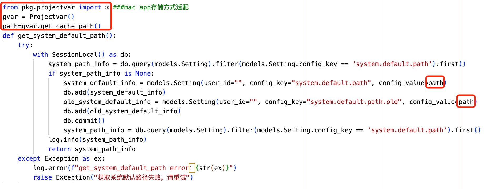
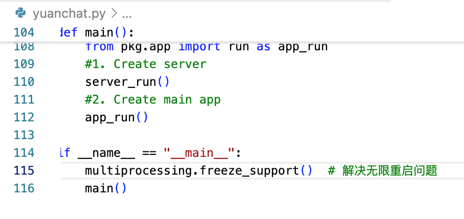

<p align="left">
  <a href="../../README.en.md">Back</a> 

# OpenChat Mac Version Packaging Guide

After downloading the program locally, ensure that your Python environment is version **3.10** (tested on 3.10.11) to match the required dependencies. First, create and activate a virtual environment using Python's built-in venv (do not use conda, as it may cause packaging issues). Then, install all dependencies with:

```sh
pip install -r requirements.txt
```

(If dependencies are missing during startup, manually install them using `pip install`.)

## Preparing for Testing


Before testing, download the packaged frontend **dist** folder and place it inside the **assets** folder at the root directory. The main entry file is `yuanchat.py`. Ensure the following modifications are made to adapt to the macOS system.

### 1. Modify Database Path
macOS does not support paths with a leading dot (`.`) in database directories, as it hides the folder. Remove the dot (`.`) before `openchat` to avoid issues.

**Location:** `pkg/projectvar/constant.py`


### 2. Update Server Path
Modify `Server.py` to prevent directory lookup failures. Replace the following line in line 54:

```python
dir = os.path.join(gvar.get_home_path())
```
with:

```python
dir = os.path.dirname(sys.argv[0])
```

Also, add `import sys` at the beginning of the file.

**Location:** `pkg/server/server.py`


### 3. Remove TKinter Dependencies
Comment out lines **12-15** in `app.py` that reference `tk`, as `tk` causes crashes on macOS.

**Location:** `pkg/app/app.py`

Additionally, adjust the `width` and `height` values as needed (e.g., `1200, 800`).


### 4. Change Localhost to 127.0.0.1
macOS security policies prevent using `localhost`. Replace `localhost` with `127.0.0.1` in line 51 of `data_init.py`.

**Location:** `pkg/database/data_init.py`


### 5. Adjust Knowledge Base Storage Path
Since macOS restricts writing within the app bundle, store the knowledge base outside the app. Modify `get_system_default_path()` to assign the database storage path to `system-default-info`.

**Location:** `pkg/server/process`



### 6. Fix Multiple Window Issues(optional)
On macOS, running the program might cause multiple windows to open continuously. Add the following line to `yuanchat.py` inside `main`:

```python
multiprocessing.freeze_support()
```

Also, import `multiprocessing` at the beginning of the file.

**Location:** `yuanchat.py`



## Packaging with PyInstaller

After making the necessary changes and testing the program, package it using PyInstaller. If PyInstaller is not installed, run:

```sh
pip install pyinstaller
```

Then execute the following command to create a macOS app:

```sh
pyinstaller --clean --onedir --windowed --name "OpenChat" \
  --add-data "pkg:pkg" \
  --add-data "assets:assets" \
  --osx-bundle-identifier com.example.openchat \
  --hidden-import=imghdr \
  yuanchat.py
```

The packaging process takes **7-8 minutes**. Once completed, you will see `dist` and `build` folders in the root directory.

### 1. Copy Required Files
Copy the `pkg` and `assets` folders into:

```
dist/OpenChat.app/Contents/MacOS/
```


### 2. Manually Add Missing Dependencies
PyInstaller may exclude certain dependencies. Locate the missing dependencies in:

```
venv/lib/python3.10/site-packages/
```

Copy the following dependencies (or your specific versions) into:

```
dist/OpenChat.app/Contents/Frameworks/
```

It is recommended to create a new folder for file transfer to avoid repeated searching when packaging again later.

#### Required Dependencies:
```
absl
absl_py-2.1.0.dist-info
babel
babel-2.17.0.dist-info
backoff
backoff-2.2.1.dist-info
chroma_hnswlib
chroma_hnswlib-0.7.6.dist-info
chromadb
chromadb-0.5.17.dist-info
courlan
courlan-1.3.2.dist-info
dateparser
dateparser_cli
dateparser_data
dateparser_scripts
dateparser-1.2.1.dist-info
emoji
emoji-2.14.1.dist-info
htmldate
htmldate-1.8.1.dist-info
justext
justext-3.0.2.dist-info
langchain
langchain_text_splitters
langchain_text_splitters-0.0.2.dist-info
langchain-0.1.16.dist-info
mobi
mobi-0.3.3.dist-info
monotonic-1.6.dist-info
monotonic.py
onnxruntime
onnxruntime-1.15.1.dist-info
passlib
passlib-1.7.4.dist-info
posthog
posthog-3.19.0.dist-info
pypdf
pypdf-5.3.1.dist-info
PyPDF2
pypdf2-3.0.1.dist-info
pypika
pypika-0.48.9.dist-info
pytesseract
pytesseract-0.3.13.dist-info
rouge_score
rouge_score-0.1.2-py3.10.egg-info
tld
tld-0.13.dist-info
trafilatura
trafilatura-1.9.0.dist-info
tzlocal
tzlocal-5.3.1.dist-info
unstructured
unstructured_client
unstructured_client-0.31.1.dist-info
unstructured-0.16.3.dist-info
urllib
```
(Ensure all necessary dependencies are included.)

## Creating a DMG Package
After verifying that the **.app** runs properly, package it into a DMG file using macOS's built-in `hdiutil`:

```sh
hdiutil create -volname "OpenChat" -srcfolder "dist/OpenChat.app" -ov -format UDBZ "OpenChat.dmg"
```

The generated `OpenChat.dmg` file will appear in the root directory, ready for distribution.
