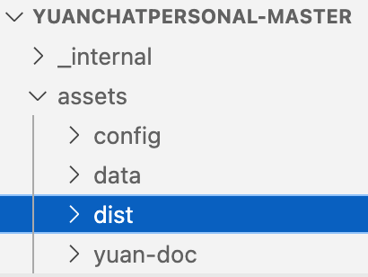

<p align="left">
  <a href="../../README.md">返回</a> 


# OpenChat Mac 版本打包指南

在本地下载程序后，请确保你的 Python 版本为 **3.10**（已在 3.10.11 版本上测试），以匹配所需的依赖环境。首先，使用 Python 自带的 venv 创建并进入虚拟环境（不要使用 conda，否则可能会导致打包问题）。然后，安装所有依赖：

```sh
pip install -r requirements.txt
```

（如果在启动过程中缺少依赖，请使用 `pip install` 手动安装。）

## 测试准备



在测试之前，请下载打包好的前端 **dist** 文件夹，并将其放入根目录下的 **assets** 文件夹中。程序的入口文件为 `yuanchat.py`。请确保完成以下修改，以适配 macOS 系统。

### 1. 修改数据库路径
macOS 不支持数据库路径中包含 `.`（点），否则该文件夹会被隐藏，导致无法查看或删除数据库。

**文件位置:** `pkg/projectvar/constant.py`


### 2. 修改服务器路径
修改 `Server.py` 以避免目录查找失败。找到 **第 54 行**，将以下代码：

```python
dir = os.path.join(gvar.get_home_path())
```

替换为：

```python
dir = os.path.dirname(sys.argv[0])
```

同时，在文件开头添加 `import sys`。

**文件位置:** `pkg/server/server.py`


### 3. 移除 TKinter 依赖
在 `app.py` 中注释掉 **12-15 行** 相关 `tk` 的代码，`tk` 在 macOS 上可能导致程序崩溃。

**文件位置:** `pkg/app/app.py`

此外，可根据需求调整 `width` 和 `height` 的值，例如 `1200, 800`。


### 4. 修改 Localhost
macOS 安全策略限制 `localhost` 端口的使用，需要将 **51 行** `localhost` 改为 `127.0.0.1`。

**文件位置:** `pkg/database/data_init.py`


### 5. 调整知识库存储路径
macOS 打包后的应用无法写入内部路径，因此需要将知识库存储到程序外部。修改 `get_system_default_path()`，并将数据库存储路径赋值到 `system-default-info`。

**文件位置:** `pkg/server/process`


### 6. 解决多窗口问题（可选）
在 macOS 上，打开程序可能会出现多窗口持续弹出的情况。可在 `yuanchat.py` 的 `main` 函数中加入：

```python
multiprocessing.freeze_support()
```

并在文件开头导入 `multiprocessing`。

**文件位置:** `yuanchat.py`


## 使用 PyInstaller 进行打包

完成上述修改并测试后，可使用 PyInstaller 进行打包。如果未安装 PyInstaller，请运行：

```sh
pip install pyinstaller
```

然后执行以下命令创建 macOS 应用：

```sh
pyinstaller --clean --onedir --windowed --name "OpenChat" \
  --add-data "pkg:pkg" \
  --add-data "assets:assets" \
  --osx-bundle-identifier com.example.openchat \
  --hidden-import=imghdr \
  yuanchat.py
```

打包过程预计 **7-8 分钟**，成功后将在根目录下生成 `dist` 和 `build` 文件夹。

### 1. 复制必要文件
复制 `pkg` 和 `assets` 文件夹到以下路径：

```
dist/OpenChat.app/Contents/MacOS/
```


### 2. 手动添加缺失的依赖
PyInstaller 可能会遗漏某些依赖项，可在 `venv/lib/python3.10/site-packages/` 目录下找到，并复制以下依赖项（或相应版本）到：

```
dist/OpenChat.app/Contents/Frameworks/
```

#### 可能需要的依赖包：

```
absl
absl_py-2.1.0.dist-info
babel
babel-2.17.0.dist-info
backoff
backoff-2.2.1.dist-info
chroma_hnswlib
chroma_hnswlib-0.7.6.dist-info
chromadb
chromadb-0.5.17.dist-info
courlan
courlan-1.3.2.dist-info
dateparser
dateparser_cli
dateparser_data
dateparser_scripts
dateparser-1.2.1.dist-info
emoji
emoji-2.14.1.dist-info
htmldate
htmldate-1.8.1.dist-info
justext
justext-3.0.2.dist-info
langchain
langchain_text_splitters
langchain_text_splitters-0.0.2.dist-info
langchain-0.1.16.dist-info
mobi
mobi-0.3.3.dist-info
monotonic-1.6.dist-info
monotonic.py
onnxruntime
onnxruntime-1.15.1.dist-info
passlib
passlib-1.7.4.dist-info
posthog
posthog-3.19.0.dist-info
pypdf
pypdf-5.3.1.dist-info
PyPDF2
pypdf2-3.0.1.dist-info
pypika
pypika-0.48.9.dist-info
pytesseract
pytesseract-0.3.13.dist-info
rouge_score
rouge_score-0.1.2-py3.10.egg-info
tld
tld-0.13.dist-info
trafilatura
trafilatura-1.9.0.dist-info
tzlocal
tzlocal-5.3.1.dist-info
unstructured
unstructured_client
unstructured_client-0.31.1.dist-info
unstructured-0.16.3.dist-info
urllib
```

## 创建 DMG 安装包
确认 `.app` 运行正常后，使用 macOS 自带的 `hdiutil` 进行打包：

```sh
hdiutil create -volname "OpenChat" -srcfolder "dist/OpenChat.app" -ov -format UDBZ "OpenChat.dmg"
```

生成的 `OpenChat.dmg` 文件将在根目录下，可用于分发。
